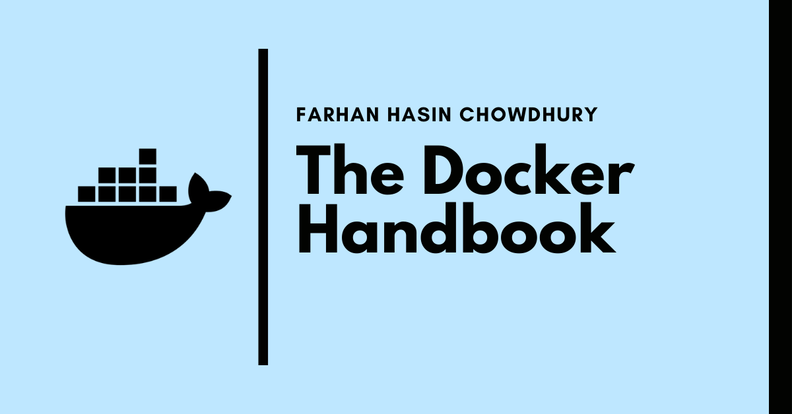

# The Docker Handbook

The concept of containerization itself is pretty old, but the emergence of the [Docker Engine](https://docs.docker.com/get-started/overview/#docker-engine) in 2013 has made it much easier to containerize your applications.

According to the [Stack Overflow Developer Survey - 2020](https://insights.stackoverflow.com/survey/2020#overview), [Docker](https://docker.com/) is the [\#1 most wanted platform](https://insights.stackoverflow.com/survey/2020#technology-most-loved-dreaded-and-wanted-platforms-wanted5), [\#2 most loved platform](https://insights.stackoverflow.com/survey/2020#technology-most-loved-dreaded-and-wanted-platforms-loved5), and also the [\#3 most popular platform](https://insights.stackoverflow.com/survey/2020#technology-platforms).

As in-demand as it may be, getting started can seem a bit intimidating at first. So in this article, we'll be learning everything from basic to intermediate level of containerization. After going through the entire article, you should be able to:

* Containerize \(almost\) any application
* Upload custom Docker Images to online registries
* Work with multiple containers using Docker Compose

### Prerequisites

* Familiarity with the Linux Terminal
* Familiarity with JavaScript \(some of the later projects use JavaScript\)

### Project Code

Code for the example projects can be found in the following repository:



You can find the complete code in the [`containerized`](https://github.com/fhsinchy/docker-handbook-projects/tree/containerized) branch.

