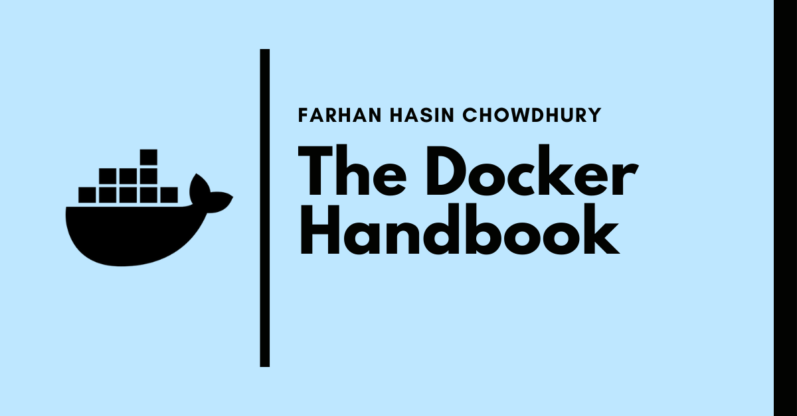

# The Docker Handbook



The concept of containerization itself is pretty old, but the emergence of the [Docker Engine](https://docs.docker.com/get-started/overview/#docker-engine) in 2013 has made it much easier to containerize your applications.

As in-demand as it may be, getting started can seem a bit intimidating at first. So in this book, I'll walk you through everything from basic to intermediate level containerization. After going through the entire book, you should be able to:

* Containerize \(almost\) any application
* Upload custom Docker images to online registries
* Work with multiple containers using Docker Compose
* Write production-minded Dockerfiles with multi-stage builds

## Prerequisites

* Familiarity with the Linux terminal
* Familiarity with JavaScript \(some later projects use JavaScript\)

## Project Code

Code for the example projects can be found in the following repository:

[https://github.com/fhsinchy/docker-handbook-projects/](https://github.com/fhsinchy/docker-handbook-projects/)

Each project contains its own `starter/` and `completed/` directories. The `starter/` directory is where you begin, and the `completed/` directory has the final version for reference.

## Contributing

This book is completely open-source and quality contributions are more than welcomed. You can find the full content in the following repository:

[https://github.com/fhsinchy/the-docker-handbook](https://github.com/fhsinchy/the-docker-handbook)

Before opening a pull request, please run `npm run check` to make sure the build passes and all links are valid.

## Local Development

```text
npm install
npm run dev
```

To run all validation checks:

```text
npm run check
```

