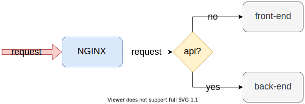
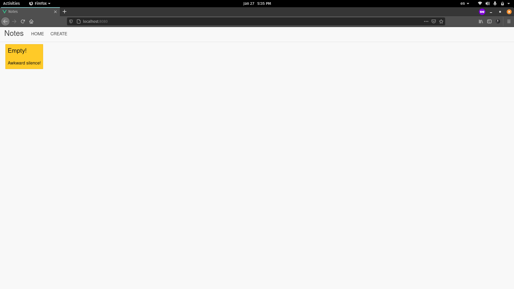

# Composing Projects Using Docker-Compose

In the previous section, you've learned about managing a multi-container project and the difficulties of it. Instead of writing so many commands, there is an easier to manage multi-container projects, a tool called [Docker Compose](https://docs.docker.com/compose/).

According to the Docker [documentation](https://docs.docker.com/compose/) - "Compose is a tool for defining and running multi-container Docker applications. With Compose, you use a YAML file to configure your application’s services. Then, with a single command, you create and start all the services from your configuration."

Although Compose works in all environments, it's more focused on development and testing. Using Compose on a production environment is not recommended at all.

## Compose Basics

Go the directory where you've cloned the repository that came with this article. Go inside the `notes-api/api` directory and create a `Dockerfile.dev` file. Put following code in it:

```text
# stage one
FROM node:lts-alpine as builder

# install dependencies for node-gyp
RUN apk add --no-cache python make g++

WORKDIR /app

COPY ./package.json .
RUN npm install

# stage two
FROM node:lts-alpine

ENV NODE_ENV=development

USER node
RUN mkdir -p /home/node/app
WORKDIR /home/node/app

COPY . .
COPY --from=builder /app/node_modules /home/node/app/node_modules

CMD [ "./node_modules/.bin/nodemon", "--config", "nodemon.json", "bin/www" ]
```

The code is almost identical to the `Dockerfile` that you worked with in the previous section. The three differences in this file are as follows:

* On line 10, we run `npm install` instead of `npm run install --only=prod` because we want the development dependencies also.
* On line 15, we set the `NODE_ENV` environment variable to `development` instead of `production`.
* On line 24, we use a tool called [nodemon](https://nodemon.io/) to get hot-reload feature for the API.

You already know that this project has two containers:

* `notes-db` - A database server powered by PostgreSQL.
* `notes-api` - A REST API powered by Express.js

In the world of compose, each container that makes up the application is known as a service and the first step to composing a multi-container project is to define these services.

Just like the Docker daemon uses a `Dockerfile` for building images, Docker Compose uses `docker-compose.yaml` file to read service definitions from.

Head to the `notes-api` directory and create a new `docker-compose.yaml` file. Put following code into the newly created file:

```text
version: "3.8"

services: 
    db:
        image: postgres:12
        container_name: notes-db-dev
        volumes: 
            - notes-db-dev-data:/var/lib/postgresql/data
        environment:
            POSTGRES_DB: notesdb
            POSTGRES_PASSWORD: secret
    api:
        build:
            context: ./api
            dockerfile: Dockerfile.dev
        image: notes-api:dev
        container_name: notes-api-dev
        environment: 
            DB_HOST: db ## same as the database service name
            DB_DATABASE: notesdb
            DB_PASSWORD: secret
        volumes: 
            - /home/node/app/node_modules
            - ./api:/home/node/app
        ports: 
            - 3000:3000

volumes:
    notes-db-dev-data:
        name: notes-db-dev-data
```

Every valid `docker-compose.yaml` file starts by defining the file version. At the time of writing, `3.8` is the latest version. You can look up the latest version [here](https://docs.docker.com/compose/compose-file/).

Blocks in an YAML file are defined by indentation. I will go through each of the blocks and will explain what they do.

* The `services` block holds the definitions for each of the services or containers in the application. `db` and `api` are the two services that comprise this project.
* The `db` block defines a new service in the application and holds necessary information to start the container. Every service requires either a pre-built image or a `Dockerfile` to run a container. For the `db` service we're using the official PostgreSQL image.
* Unlike the `db` service, a pre-built image for the `api` service doesn't exist. Hence, we use the `Dockerfile.dev` file.
* The `volumes` block defines any name volume needed by any of the services. At the time it only enlists `notes-db-dev-data` volume used by the `db` service.

Now that have a high level overview of the `docker-compose.yaml` file, lets have a closer look at the individual services.

Definition code for the `db` service is as follows:

```text
db:
    image: postgres:12
    container_name: notes-db-dev
    volumes: 
        - db-data:/var/lib/postgresql/data
    environment:
        POSTGRES_DB: notesdb
        POSTGRES_PASSWORD: secret
```

* The `image` key holds the image repository and tag used for this container. We're using the `postgres:12` image for running the database container.
* The `container_name` indicates the name of the container. By default containers are named following `<project directory name>_<service name>` syntax. You can override that using `container_name`.
* The `volumes` array holds the volume mappings for the service and supports named volumes, anonymous volumes, bind mounts. The syntax `<source>:<destination>` is identical to what you've seen before. 
* The `environment` map holds the values of the various environment variables needed for the service.

Definition code for the `api` service is as follows:

```text
api:
    build:
        context: ./api
        dockerfile: Dockerfile.dev
    image: notes-api:dev
    container_name: notes-api-dev
    environment: 
        DB_HOST: db ## same as the database service name
        DB_DATABASE: notesdb
        DB_PASSWORD: secret
    volumes: 
        - /home/node/app/node_modules
        - ./api:/home/node/app
    ports: 
        - 3000:3000
```

* The `api` service doesn't come with a pre-built image instead what it has is a build configuration. Under the `build` block we define the context and the name of the Dockerfile for building an image. You should have a understanding of context and Dockerfile by now so I won't spend time explaining those.
* The `image` key holds the name of the image to be build. If not assigned the image will be named following the `<project directory name>_<service name>` syntax.
* Inside the `environment` map, the `DB_HOST` variable demonstrates a feature of Compose. That is, you can refer to another service in the same application by using its name. So the `db` here, will be replaced by the IP address of the `api` service container. The `DB_DATABASE` and `DB_PASSWORD` variables have to match up with `POSTGRES_DB` and `POSTGRES_PASSWORD` respectively from the `db` service definition.
* In the `volumes` map, you can see an anonymous volume and a bind mount described. The syntax is identical to what you've seen in previous sections.
* The `ports` map defines any port mapping. The syntax, `<host port>:<container port>` is identical to the `--publish` option you used before.

Finally, code for the `volumes` is as follows:

```text
volumes:
    db-data:
        name: notes-db-dev-data
```

Any named volume used in any of the services has to be defined here. If you don't define a name, the volume will be named following the `<project directory name>_<volume key>` and the key here is `db-data`. You can learn about the different options for volume configuration in the official [docs](https://docs.docker.com/compose/compose-file/compose-file-v3/#volumes).

## Starting Services

There are a few ways of starting services defined in a YAML file. The first command that you'll learn about is the `up` command. The `up` command builds any missing images, creates containers and starts them in one go.

Before you execute the command though, make sure you've open your terminal in the same directory where the `docker-compose.yaml` file is. This is very important for every `docker-compose` command you execute.

```text
docker-compose --file docker-compose.yaml up --detach

# Creating network "notes-api_default" with the default driver
# Creating volume "notes-db-dev-data" with default driver
# Building api
# Sending build context to Docker daemon  37.38kB
#
# Step 1/13 : FROM node:lts-alpine as builder
#  ---> 471e8b4eb0b2
# Step 2/13 : RUN apk add --no-cache python make g++
#  ---> Running in 197056ec1964
### LONG INSTALLATION STUFF GOES HERE ###
# Removing intermediate container 197056ec1964
#  ---> 6609935fe50b
# Step 3/13 : WORKDIR /app
#  ---> Running in 17010f65c5e7
# Removing intermediate container 17010f65c5e7
#  ---> b10d12e676ad
# Step 4/13 : COPY ./package.json .
#  ---> 600d31d9362e
# Step 5/13 : RUN npm install
#  ---> Running in a14afc8c0743
### LONG INSTALLATION STUFF GOES HERE ###
#  Removing intermediate container a14afc8c0743
#  ---> 952d5d86e361
# Step 6/13 : FROM node:lts-alpine
#  ---> 471e8b4eb0b2
# Step 7/13 : ENV NODE_ENV=development
#  ---> Running in 0d5376a9e78a
# Removing intermediate container 0d5376a9e78a
#  ---> 910c081ce5f5
# Step 8/13 : USER node
#  ---> Running in cfaefceb1eff
# Removing intermediate container cfaefceb1eff
#  ---> 1480176a1058
# Step 9/13 : RUN mkdir -p /home/node/app
#  ---> Running in 3ae30e6fb8b8
# Removing intermediate container 3ae30e6fb8b8
#  ---> c391cee4b92c
# Step 10/13 : WORKDIR /home/node/app
#  ---> Running in 6aa27f6b50c1
# Removing intermediate container 6aa27f6b50c1
#  ---> 761a7435dbca
# Step 11/13 : COPY . .
#  ---> b5d5c5bdf3a6
# Step 12/13 : COPY --from=builder /app/node_modules /home/node/app/node_modules
#  ---> 9e1a19960420
# Step 13/13 : CMD [ "./node_modules/.bin/nodemon", "--config", "nodemon.json", "bin/www" ]
#  ---> Running in 5bdd62236994
# Removing intermediate container 5bdd62236994
#  ---> 548e178f1386
# Successfully built 548e178f1386
# Successfully tagged notes-api:dev
# Creating notes-api-dev ... done
# Creating notes-db-dev  ... done
```

The `--detach` or `-d` option here functions same as the one you've seen before. The `--file` or `-f` option is only needed if the YAML file is note named `docker-compose.yaml` but I've used here for demonstration purpose.

Apart from the the `up` command there is the `start` command. The main difference between these two is the `start` command doesn't create missing containers, only starts existing containers. It's basically same as the `container start` command.

The `--build` option for the `up` command forces a rebuild of the images. There are some other options for the `up` command that you can see on official [docs](https://docs.docker.com/compose/reference/up/).

## Listing Services

Although service containers started by Compose can be listed using the `container ls` command, there is the `ps` command for listing containers defined in the YAML only. 

```text
docker-compose ps

#     Name                   Command               State           Ports         
# -------------------------------------------------------------------------------
# notes-api-dev   docker-entrypoint.sh ./nod ...   Up      0.0.0.0:3000->3000/tcp
# notes-db-dev    docker-entrypoint.sh postgres    Up      5432/tcp
```

It's not as informative as the `container ls` output, but useful when you have tons of containers running simultaneously.

## Executing Commands Inside a Running Service

I hope you remember from the previous section that you have to run some migration scripts to create the database tables for this API. Just like the `container exec` command, there is an `exec` command for `docker-compose`. Generic syntax for the command is as follows:

```text
docker-compose exec <service name> <command>
```

To execute the `npm run db:migrate` command inside the `api` service, you can execute the following command:

```text
docker-compose exec api npm run db:migrate

# > notes-api@ db:migrate /home/node/app
# > knex migrate:latest
# 
# Using environment: development
# Batch 1 run: 1 migrations
```

Unlike the `container exec` command, you don't need to pass the `-it` flag for interactive sessions. `docker-compose` does that automatically.

## Accessing Logs From a Running Service

You can also use the `logs` command to retrieve logs from a running service. The generic syntax for the command is as follows:

```text
docker-compose logs <service name>
```

To access the logs from the `api` service execute the following command:

```text
docker-compose logs api

# Attaching to notes-api-dev
# notes-api-dev | [nodemon] 2.0.7
# notes-api-dev | [nodemon] reading config ./nodemon.json
# notes-api-dev | [nodemon] to restart at any time, enter `rs`
# notes-api-dev | [nodemon] or send SIGHUP to 1 to restart
# notes-api-dev | [nodemon] ignoring: *.test.js
# notes-api-dev | [nodemon] watching path(s): *.*
# notes-api-dev | [nodemon] watching extensions: js,mjs,json
# notes-api-dev | [nodemon] starting `node bin/www`
# notes-api-dev | [nodemon] forking
# notes-api-dev | [nodemon] child pid: 19
# notes-api-dev | [nodemon] watching 18 files
# notes-api-dev | app running -> http://127.0.0.1:3000
```

This is just a portion from the log output. You can kind of hook into the output stream of the service and get the logs in real-time by using the `-f` or `--follow` option. Any later log will show up instantly in the terminal as long as you don't exit by pressing `ctrl + c` key combination or closing the window. The container will keep running even if you exit out of the log window.

## Stopping Services

For stopping services, there are two approaches that you can take. The first one is the `down` command. The `down` command stops all running containers and removes them from the system. It also removes any networks:

```text
docker-compose down --volumes

# Stopping notes-api-dev ... done
# Stopping notes-db-dev  ... done
# Removing notes-api-dev ... done
# Removing notes-db-dev  ... done
# Removing network notes-api_default
# Removing volume notes-db-dev-data
```

The `--volumes` option indicates that you want to remove any named volume defined in the `volumes` block. You can learn about the additional options for the `down` command in the official [docs](https://docs.docker.com/compose/reference/down/).

Another command for stopping services is the `stop` command which functions identically to the `container stop` command. It stops all the containers for the application and keeps the contianers. These containers can later be started with the `start` or `up` command.

## Composing a Full-stack Application

In this sub-section, we'll be adding a front-end to our notes API and turn it into a complete fullstack application. I won't be explaining any of the `Dockerfile.dev` files in this sub-section \(except the one for the `nginx` service\) as they are identical to some of the others you've already seen in previous sub-sections.

If you've cloned the project code repository, then go inside the `fullstack-notes-application` directory. Each directory inside the project root contains the code for each services and the corresponding `Dockerfile`.

Before we start with the `docker-compose.y`a`ml` file let's look at a diagram of how the application is going to work:



Instead of accepting requests directly like we previously did, in this application, all the requests will be first received by a NGINX \(lets call it router\) service. The router will then see if the requested end-point has `/api` in it. If yes, the router will route the request to the back-end or if not, the router will route the request to the front-end.

The reason behind doing this is that when you run a front-end application it doesn't run inside a container. It runs on the browser, served from a container. As a result, Compose networking doesn't work as expected and the front-end application fails to find the `api` service.

NGINX on the other hand runs inside a container and can communicate with the different services across the entire application.

I will not get into the configuration of NGINX here. That topic is kinda out of scope of this article. But if you want to have a look at it, go ahead and checkout the `/notes-api/nginx/development.conf` and `/notes-api/nginx/production.conf` files. Code for the `/notes-api/nginx/Dockerfile.dev` is as follows:

```text
FROM nginx:stable-alpine

COPY ./development.conf /etc/nginx/conf.d/default.conf
```

All it does is copy the configuration file to `/etc/nginx/conf.d/default.conf` inside the container.

Let's start writing the `docker-compose.yaml` file. Apart from the `api` and `db` services there will be the `client` and `nginx` services. There will also be some network definitions that I'll get into shortly.

```text
version: "3.8"

services: 
    db:
        image: postgres:12
        container_name: notes-db-dev
        volumes: 
            - db-data:/var/lib/postgresql/data
        environment:
            POSTGRES_DB: notesdb
            POSTGRES_PASSWORD: secret
        networks:
            - backend
    api:
        build: 
            context: ./api
            dockerfile: Dockerfile.dev
        image: notes-api:dev
        container_name: notes-api-dev
        volumes: 
            - /home/node/app/node_modules
            - ./api:/home/node/app
        environment: 
            DB_HOST: db ## same as the database service name
            DB_PORT: 5432
            DB_USER: postgres
            DB_DATABASE: notesdb
            DB_PASSWORD: secret
        networks:
            - backend
    client:
        build:
            context: ./client
            dockerfile: Dockerfile.dev
        image: notes-client:dev
        container_name: notes-client-dev
        volumes: 
            - /home/node/app/node_modules
            - ./client:/home/node/app
        networks:
            - frontend
    nginx:
        build:
            context: ./nginx
            dockerfile: Dockerfile.dev
        image: notes-router:dev
        container_name: notes-router-dev
        restart: unless-stopped
        ports: 
            - 8080:80
        networks:
            - backend
            - frontend

volumes:
    db-data:
        name: notes-db-dev-data

networks: 
    frontend:
        name: fullstack-notes-application-network-frontend
        driver: bridge
    backend:
        name: fullstack-notes-application-network-backend
        driver: bridge

```

The file is almost identical to the previous one you worked with. Only thing that needs some explanation is the network configuration. Code for the `networks` block is as follows:

```text
networks: 
    frontend:
        name: fullstack-notes-application-network-frontend
        driver: bridge
    backend:
        name: fullstack-notes-application-network-backend
        driver: bridge
```

I've defined two bridge networks. By default Compose creates a bridge network and attaches all containers to that. In this project however, I wanted proper network isolation. So I defined two networks, one for the front-end services and one for the back-end  services.

I've also added `networks` block in each of the service definitions. This way the the `api` and `db` service will be attached to one network and the `client` service will be attached to a separate network. The `nginx` service however will be attached to both the networks so that it can perform as router between the front-end and back-end services.

Start all the services by executing following command:

```text
docker-compose --file docker-compose.yaml up --detach

# Creating network "fullstack-notes-application-network-backend" with driver "bridge"
# Creating network "fullstack-notes-application-network-frontend" with driver "bridge"
# Creating volume "notes-db-dev-data" with default driver
# Building api
# Sending build context to Docker daemon  37.38kB
# 
# Step 1/13 : FROM node:lts-alpine as builder
#  ---> 471e8b4eb0b2
# Step 2/13 : RUN apk add --no-cache python make g++
#  ---> Running in 8a4485388fd3
### LONG INSTALLATION STUFF GOES HERE ###
# Removing intermediate container 8a4485388fd3
#  ---> 47fb1ab07cc0
# Step 3/13 : WORKDIR /app
#  ---> Running in bc76cc41f1da
# Removing intermediate container bc76cc41f1da
#  ---> 8c03fdb920f9
# Step 4/13 : COPY ./package.json .
#  ---> a1d5715db999
# Step 5/13 : RUN npm install
#  ---> Running in fabd33cc0986
### LONG INSTALLATION STUFF GOES HERE ###
# Removing intermediate container fabd33cc0986
#  ---> e09913debbd1
# Step 6/13 : FROM node:lts-alpine
#  ---> 471e8b4eb0b2
# Step 7/13 : ENV NODE_ENV=development
#  ---> Using cache
#  ---> b7c12361b3e5
# Step 8/13 : USER node
#  ---> Using cache
#  ---> f5ac66ca07a4
# Step 9/13 : RUN mkdir -p /home/node/app
#  ---> Using cache
#  ---> 60094b9a6183
# Step 10/13 : WORKDIR /home/node/app
#  ---> Using cache
#  ---> 316a252e6e3e
# Step 11/13 : COPY . .
#  ---> Using cache
#  ---> 3a083622b753
# Step 12/13 : COPY --from=builder /app/node_modules /home/node/app/node_modules
#  ---> Using cache
#  ---> 707979b3371c
# Step 13/13 : CMD [ "./node_modules/.bin/nodemon", "--config", "nodemon.json", "bin/www" ]
#  ---> Using cache
#  ---> f2da08a5f59b
# Successfully built f2da08a5f59b
# Successfully tagged notes-api:dev
# Building client
# Sending build context to Docker daemon  43.01kB
# 
# Step 1/7 : FROM node:lts-alpine
#  ---> 471e8b4eb0b2
# Step 2/7 : USER node
#  ---> Using cache
#  ---> 4be5fb31f862
# Step 3/7 : RUN mkdir -p /home/node/app
#  ---> Using cache
#  ---> 1fefc7412723
# Step 4/7 : WORKDIR /home/node/app
#  ---> Using cache
#  ---> d1470d878aa7
# Step 5/7 : COPY ./package.json .
#  ---> Using cache
#  ---> bbcc49475077
# Step 6/7 : RUN npm install
#  ---> Using cache
#  ---> 860a4a2af447
# Step 7/7 : CMD [ "npm", "run", "serve" ]
#  ---> Using cache
#  ---> 11db51d5bee7
# Successfully built 11db51d5bee7
# Successfully tagged notes-client:dev
# Building nginx
# Sending build context to Docker daemon   5.12kB
# 
# Step 1/2 : FROM nginx:stable-alpine
#  ---> f2343e2e2507
# Step 2/2 : COPY ./development.conf /etc/nginx/conf.d/default.conf
#  ---> Using cache
#  ---> 02a55d005a98
# Successfully built 02a55d005a98
# Successfully tagged notes-router:dev
# Creating notes-client-dev ... done
# Creating notes-api-dev    ... done
# Creating notes-router-dev ... done
# Creating notes-db-dev     ... done
```

Now visit `http://localhost:8080` and voilà!



Try adding and deleting notes to see if the application works properly or not. The project also comes with shell scripts and a `Makefile`. Explore them to see how you can run this project without the help of `docker-compose` like you did in the previous section.

