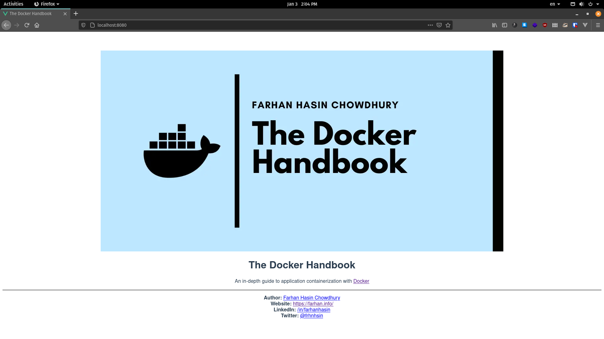

# Containerizing a JavaScript Application

Now that you've got some idea of creating images, it's time to work with something a bit more relevant. In this sub-section, you'll be working with the source code of the [fhsinchy/hello-dock](https://hub.docker.com/r/fhsinchy/hello-dock) image that you worked with on a previous section. In the process of containerizing this very simple application, you'll be introduced to volumes and multi-staged builds, two of the most important concepts in Docker.

## Writing The Development Dockerfile

To begin with, open up the directory where you've cloned the repository that came with this article. Code for the `hello-dock` application resides inside the sub-directory with the same name.

This is a very simple JavaScript project powered by the [vitejs/vite](https://github.com/vitejs/vite) project. Don't worry though, you don't need to know JavaScript or vite in order to go through this sub-section. Having a basic understanding of [Node.js](https://nodejs.org/) and [npm](https://www.npmjs.com/) will suffice.

Just like any other project you've done in the previous sub-section, you'll begin by making a plan of how you want this application to run. In my opinion, the plan should be as follows:

* Get a good base image for running JavaScript applications i.e. [node](https://hub.docker.com/_/node).
* Set the default working directory inside the image.
* Copy the `package.json` file into the image.
* Install necessary dependencies.
* Copy rest of the project files.
* Start the `vite` development server by executing `npm run dev` command.

This plan should always come from the developer of the application that you're containerizing. If you're the developer yourself, then you should already have a proper understanding of how this application needs to be run. Now if you put the above mentioned plan inside `Dockerfile.dev`, the file should look like as follows:

```text
FROM node:lts-alpine

EXPOSE 3000

USER node

RUN mkdir -p /home/node/app

WORKDIR /home/node/app

COPY ./package.json .
RUN npm install

COPY . .

CMD [ "npm", "run", "dev" ]
```

Explanation for this code is as follows:

* The `FROM` instruction here sets the official Node.js image as the base giving you all the goodness of Node.js necessary to run any JavaScript application. The `lts-alpine` tag indicates that you want to use the Alpine variant, long term support version of the image. Available tags and necessary documentation for the image can be found on [node](https://hub.docker.com/_/node) hub page.
* The `USER` instruction sets the default user for the image to `node`. By default Docker runs containers as the root user and according to [Docker and Node.js Best Practices](https://github.com/nodejs/docker-node/blob/master/docs/BestPractices.md) this can pose a security threat. So a better idea is to run as a non-root user whenever possible. The node image comes with a non-root user named `node` which you can set as the default user using the `USER` instruction.
* The `RUN mkdir -p /home/node/app` instruction creates a directory called `app` inside the home directory of the `node` user. The home directory for any non-root user in Linux is usually  `/home/<user name>` by default.
* Then the `WORKDIR` instruction sets the default working directory to the newly created `/home/node/app` directory. By default the working directory of any image is the root. You don't want any unnecessary files sprayed all over your root directory, do you? Hence you change the default working directory to something more sensible like `/home/node/app` or whatever you like. This working directory will be applicable to any subsequent `COPY`, `ADD`, `RUN` and `CMD` instructions.
* The `COPY` instruction here copies the `package.json` file which contains information regarding all the necessary dependencies for this application. The `RUN` instruction executes `npm install` command which is the default command for installing dependencies using a `package.json` file in Node.js projects. The `.` at the end represents the working directory.
* The second `COPY` instruction copies rest of the content from the current directory \(`.`\) of the host filesystem to the working directory \(`.`\) inside the image.
* Finally, the `CMD` instruction here sets the default command for this image which is `npm run dev` written in `exec` form.
* The `vite` development server by default runs on port `3000` hence adding an `EXPOSE` command seemed like a good idea, so there you go.

Now, to build an image from this `Dockerfile.dev` you can execute the following command:

```text
docker image build --file Dockerfile.dev --tag hello-dock:dev .

# Step 1/7 : FROM node:lts
#  ---> b90fa0d7cbd1
# Step 2/7 : EXPOSE 3000
#  ---> Running in 722d639badc7
# Removing intermediate container 722d639badc7
#  ---> e2a8aa88790e
# Step 3/7 : WORKDIR /app
#  ---> Running in 998e254b4d22
# Removing intermediate container 998e254b4d22
#  ---> 6bd4c42892a4
# Step 4/7 : COPY ./package.json .
#  ---> 24fc5164a1dc
# Step 5/7 : RUN npm install
#  ---> Running in 23b4de3f930b
### LONG INSTALLATION STUFF GOES HERE ###
# Removing intermediate container 23b4de3f930b
#  ---> c17ecb19a210
# Step 6/7 : COPY . .
#  ---> afb6d9a1bc76
# Step 7/7 : CMD [ "npm", "run", "dev" ]
#  ---> Running in a7ff529c28fe
# Removing intermediate container a7ff529c28fe
#  ---> 1792250adb79
# Successfully built 1792250adb79
# Successfully tagged hello-dock:dev
```

Given the filename is not `Dockerfile` you have to explicitly pass the filename using the `--file` option. A container can be run using this image by executing the following command:

```text
docker container run \
    --rm \
    --detach \
    --publish 3000:3000 \
    --name hello-dock-dev \
    hello-dock:dev

# 21b9b1499d195d85e81f0e8bce08f43a64b63d589c5f15cbbd0b9c0cb07ae268
```

Now visit `http://127.0.0.1:3000` do see the `hello-dock` application in action.


Congratulations on running your first real-world application inside a container. The code you've just written is okay but there is one big issue with it and a few places where it can be improved. Let's begin with the issue first.

## Working With Bind Mounts

If you've worked with any front-end JavaScript framework before, you should know that the development servers in these frameworks usually come with a hot reload feature. That is if you make a change in your code, the server will reload automatically reflecting any changes you've made immediately.

But if you make any change in your code right now, you'll see nothing happening to your application running in the browser. The reason behind this is the fact that you're making changes in the code that you have in your local file system but the application you're seeing in the browser resides inside the container file system.


To solve this issue, you can again make use of a [bind mount](https://docs.docker.com/storage/bind-mounts/). You've already had a brief encounter of bind mounts in the [Working With Executable Images](container-manipulation-basics.md#working-with-executable-images) sub-section.

Using bind mounts, you can easily mount one of your local file system directory inside a container. Instead of making a copy of the local file system, the bind mount can reference the local file system directly from inside the container.


This way, any changes you make to your local source code will reflect immediately inside the container,  triggering the hot reload feature of `vite` development server. Changes made to the file system inside the container will reflect on your local file system as well.

You've already learned in the [Working With Executable Images](container-manipulation-basics.md#working-with-executable-images) sub-section, bind mounts can be created using the `--volume` or `-v` option for the `container run` or `container start` commands. Just to remind you, the generic syntax is as follows: 

```text
--volume <local file system directory absolute path>:<container file system directory absolute path>:<read write access>
```

Stop your previously started `hello-dock-dev` container, and start a new container by executing the following command:

```text
docker container run \
    --rm \
    --publish 3000:3000 \
    --name hello-dock-dev \
    --volume $(pwd):/home/node/app \
    hello-dock:dev

# sh: 1: vite: not found
# npm ERR! code ELIFECYCLE
# npm ERR! syscall spawn
# npm ERR! file sh
# npm ERR! errno ENOENT
# npm ERR! hello-dock@0.0.0 dev: `vite`
# npm ERR! spawn ENOENT
# npm ERR!
# npm ERR! Failed at the hello-dock@0.0.0 dev script.
# npm ERR! This is probably not a problem with npm. There is likely additional logging output above.
# npm WARN Local package.json exists, but node_modules missing, did you mean to install?
```

Keep in mind, I've omitted the `--detach` option and that's to demonstrate a very important point. As you can see that the application is not running at all now.

That's because although the usage of a volume solves the issue of hot reloads, it introduces another one. If you have any previous experience with Node.js, you may know that the dependencies of a Node.js project lives inside the `node_modules` directory on the project root.

Now that you're mounting the project root on your local file system as a volume inside the container, the content inside the container gets replaced along with the `node_modules` directory containing all the dependencies.  Hence the `vite` package goes missing.

## Working With Anonymous Volumes

This problem here can be solved using an anonymous volume. An anonymous volume is identical to a bind mount except the fact that you don't need to specify the source directory here. The generic syntax for creating an anonymous volume is as follows:

```text
--volume <container file system directory absolute path>:<read write access>
```

So the final command for starting the `hello-dock` container with both volumes should be as follows:

```text
docker container run \
    --rm \
    --detach \
    --publish 3000:3000 \
    --name hello-dock-dev \
    --volume $(pwd):/home/node/app \
    --volume /home/node/app/node_modules \
    hello-dock:dev

# 53d1cfdb3ef148eb6370e338749836160f75f076d0fbec3c2a9b059a8992de8b
```

Here, Docker will take the entire `node_modules` directory from inside the container and tuck it away in some other directory managed by the Docker daemon on your host file system and will mount that directory as `node_modules` inside the container.

## Performing Multi-Staged Builds

So far in this section, you've built an image for running a JavaScript application in development mode. Now if you want to build the image in production mode, some new challenges show up. In development mode the `npm run serve` command starts a development server that serves the application to the user. That server not only serves the files but also provides the hot reload feature.

In production mode, the `npm run build` command compiles all your JavaScript code into some static HTML, CSS and JavaScript files. To run these files you don't need node or any other runtime dependencies. All you need is a server like `nginx` for example.

So to create an image where the application runs in production mode, you can take the following steps:

* Use `node` as the base image and build the application.
* Install `nginx` inside the node image and use that to serve the static files.

This approach is a completely valid but the problem is that the `node` image is big and most of the stuff it carries is unnecessary to serve your static files. A better approach to this scenario is as follows:

* Use `node` image as the base and build the application.
* Copy the files created using the `node` image to a `nginx` image.
* Create the final image based on `nginx` and discard all `node` related stuff.

This way your image only contains the files that are needed and becomes really handy. This approach is a multi-staged build. To perform such a build, create a new `Dockerfile` inside your `hello-dock` project directory and put following content in there:

```text
FROM node:lts-alpine as builder

WORKDIR /app

COPY ./package.json ./
RUN npm install

COPY . .
RUN npm run build

FROM nginx:stable-alpine

EXPOSE 80

COPY --from=builder /app/dist /usr/share/nginx/html
```

As you can see the `Dockerfile` looks a lot like your previous ones with a few oddities. Explanation for this file is as follows:

* Line 1 starts the first stage of the build using `node:lts-alpine` as the base image. The `as builder` syntax assigns a name to this stage so that it can be referred to later on.
* From line 3 to line 13, it's standard stuff that you've seen many times before. The `RUN npm run build` command actually compiles the entire application and tucks it inside `/app/dist` directory where `/app` is the working directory and `/dist` is the default output directory for `vite` applications.
* Line 15 starts the second stage of the build using `nginx:stable-alpine` as the base image.
* The NGINX server runs on port 80 by default hence the line `EXPOSE 80` is added.
* The last line is a `COPY` instruction. The `--from=builder` part indicates that you want to copy some files from the `builder` stage. After that it's a standard copy instruction where `/app/dist` is the source and `/usr/share/nginx/html` is the destination. The destination used here is the default site path for NGINX so any static file you put inside there will be automatically served.

As you can see the resultant image is a `nginx` base image containing only the files necessary for running the application. To build this image execute following command:

```text
docker image build --tag hello-dock:prod .

# Step 1/9 : FROM node:lts-alpine as builder
#  ---> 72aaced1868f
# Step 2/9 : WORKDIR /app
#  ---> Running in e361c5c866dd
# Removing intermediate container e361c5c866dd
#  ---> 241b4b97b34c
# Step 3/9 : COPY ./package.json ./
#  ---> 6c594c5d2300
# Step 4/9 : RUN npm install
#  ---> Running in 6dfabf0ee9f8
# npm WARN deprecated fsevents@2.1.3: Please update to v 2.2.x
#
# > esbuild@0.8.29 postinstall /app/node_modules/esbuild
# > node install.js
#
# npm notice created a lockfile as package-lock.json. You should commit this file.
# npm WARN optional SKIPPING OPTIONAL DEPENDENCY: fsevents@~2.1.2 (node_modules/chokidar/node_modules/fsevents):
# npm WARN notsup SKIPPING OPTIONAL DEPENDENCY: Unsupported platform for fsevents@2.1.3: wanted {"os":"darwin","arch":"any"} (current: {"os":"linux","arch":"x64"})
# npm WARN hello-dock@0.0.0 No description
# npm WARN hello-dock@0.0.0 No repository field.
# npm WARN hello-dock@0.0.0 No license field.
#
# added 327 packages from 301 contributors and audited 329 packages in 35.971s
#
# 26 packages are looking for funding
#   run `npm fund` for details
#
# found 0 vulnerabilities
#
# Removing intermediate container 6dfabf0ee9f8
#  ---> 21fd1b065314
# Step 5/9 : COPY . .
#  ---> 43243f95bff7
# Step 6/9 : RUN npm run build
#  ---> Running in 4d918cf18584
#
# > hello-dock@0.0.0 build /app
# > vite build
#
# - Building production bundle...
#
# [write] dist/index.html 0.39kb, brotli: 0.15kb
# [write] dist/_assets/docker-handbook-github.3adb4865.webp 12.32kb
# [write] dist/_assets/index.eabcae90.js 42.56kb, brotli: 15.40kb
# [write] dist/_assets/style.0637ccc5.css 0.16kb, brotli: 0.10kb
# - Building production bundle...
#
# Build completed in 1.71s.
#
# Removing intermediate container 4d918cf18584
#  ---> 187fb3e82d0d
# Step 7/9 : EXPOSE 80
#  ---> Running in b3aab5cf5975
# Removing intermediate container b3aab5cf5975
#  ---> d6fcc058cfda
# Step 8/9 : FROM nginx:stable-alpine
# stable: Pulling from library/nginx
# 6ec7b7d162b2: Already exists 
# 43876acb2da3: Pull complete 
# 7a79edd1e27b: Pull complete 
# eea03077c87e: Pull complete 
# eba7631b45c5: Pull complete 
# Digest: sha256:2eea9f5d6fff078ad6cc6c961ab11b8314efd91fb8480b5d054c7057a619e0c3
# Status: Downloaded newer image for nginx:stable
#  ---> 05f64a802c26
# Step 9/9 : COPY --from=builder /app/dist /usr/share/nginx/html
#  ---> 8c6dfc34a10d
# Successfully built 8c6dfc34a10d
# Successfully tagged hello-dock:prod
```

Once the image has been built, you may run a new container by executing the following command:

```text
docker container run \
    --rm \
    --detach \
    --name hello-dock-prod \
    --publish 8080:80 \
    hello-dock:prod

# 224aaba432bb09aca518fdd0365875895c2f5121eb668b2e7b2d5a99c019b953
```

The running application should be available on `http://127.0.0.1:8080` address:



Here you can see my `hello-dock` application in all it's glory. Multi-staged builds can be very useful if you're building large applications with a lot of dependencies. If configured properly, images built in multiple stages can be very optimized and compact.

## Ignoring Unnecessary Files

If you've been working with `git` for some time now, you may know about the `.gitignore` files in projects, containing a list of files and directories to be excluded from the repository. Well Docker has a similar concept. The `.dockerignore` file contains a list of files and directories to be excluded from image builds. You can find a pre-created `.dockerignore` file in the `hello-dock` directory.

```text
.git
*Dockerfile*
*docker-compose*
node_modules
```

This `.dockerignore` file has to be in the build context. Files and directories mentioned here will be ignored by the `COPY` instruction but if you do a bind mount, the `.dockerignore` file will have no effect. I've added `.dockerignore` files where necessary in the project repository.

