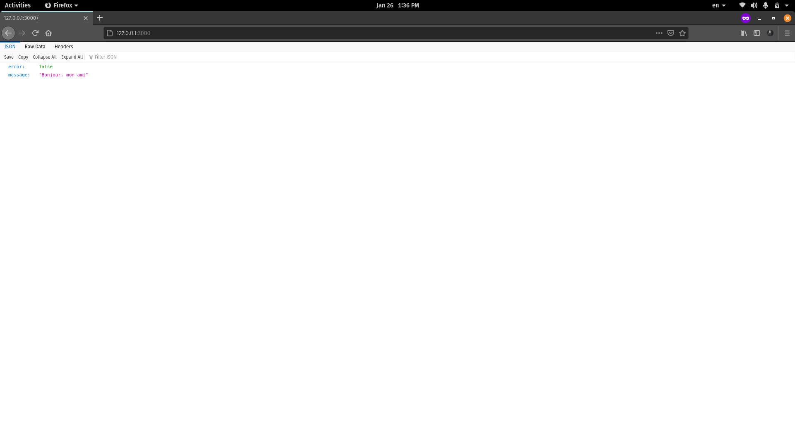

# Containerizing a Multi-Container JavaScript Application

Now that you've learned enough about networks in Docker, in this sub-section you'll learn to containerize a full-fledged multi-container project. The project you'll be working with is a simple `notes-api` powered by Express.js and PostgreSQL.

In this project there are two containers in total that you'll have to connect using a network. Apart from this, you'll also learn about concepts like environment variables and named volumes. So without further ado, lets jump right in.

## Setting Up The Custom Bridge Network

As you've learned in the previous section, the containers have to be attached to a user-defined bridge network in order to communicate with each other using container names. To do so, create a network named notes-api-network in your system:

```text
docker network create notes-api-network
```

## Running the Database Server

The database server in this project is a simple PostgreSQL server and uses the official [postgres](https://hub.docker.com/_/postgres) image. According to the official docs, in order to run a container with this image, you must provide the `POSTGRES_PASSWORD` environment variable. Apart from this one, I'll also provide a name for the default database using the `POSTGRES_DB` environment variable. PostgreSQL by default listens on `5432` port, so you need to publish that as well.

To run the database server you can execute the following command:

```text
docker container run \
    --detach \
    --name=notes-db \
    --env POSTGRES_DB=notesdb \
    --env POSTGRES_PASSWORD=secret \
    --network=notes-api-network \
    postgres:12

# a7b287d34d96c8e81a63949c57b83d7c1d71b5660c87f5172f074bd1606196dc

docker container ls

# CONTAINER ID   IMAGE         COMMAND                  CREATED              STATUS              PORTS      NAMES
# a7b287d34d96   postgres:12   "docker-entrypoint.s…"   About a minute ago   Up About a minute   5432/tcp   notes-db
```

The `--env` option for the `container run` and `container create` commands can be used for providing environment variables to a container. As you can see, the database container has been created successfully and is running now.

Although the container is running, there is a small problem. Databases like PostgreSQL, MongoDB, MySQL persist their data in a directory. PostgreSQL uses the `/var/lib/postgresql/data` directory inside the container to persist data. Now what if the container gets destroyed for some reason? You'll lose all your data. To solve this problem, a named volume can be used.

## Working With Named Volumes

Previously you've worked with bind mounts and anonymous volumes. A named volume is very similar to an anonymous volume except the fact that you can refer to a named volume using its name. Volumes are also logical objects in Docker and can be manipulated using the CLI. The `volume create` command can be used for creating a named volume.

The generic syntax for the command is as follows:

```text
docker volume create <volume name>
```

To create a volume named `notes-db-data` you can execute the following command:

```text
docker volume create notes-db-data

# notes-db-data

docker volume ls

# DRIVER    VOLUME NAME
# local     notes-db-data
```

This volume can now be mounted to `/var/lib/postgresql/data` inside the `notes-db` container. To do so, stop and remove the `notes-db` container:

```text
docker container stop notes-db

# notes-db

docker container rm notes-db

# notes-db
```

Now run a new container and assign the volume using the `--volume` or `-v` option.

```text
docker container run \
    --detach \
    --volume notes-db-data:/var/lib/postgresql/data \
    --name=notes-db \
    --env POSTGRES_DB=notesdb \
    --env POSTGRES_PASSWORD=secret \
    --network=notes-api-network \
    postgres:12

# 37755e86d62794ed3e67c19d0cd1eba431e26ab56099b92a3456908c1d346791
```

Now inspect the `notes-db` container to make sure that the mounting was successful:

```text
docker container inspect --format='{{range .Mounts}} {{ .Name }} {{end}}' notes-db

#  notes-db-data
```

Now the data will safely stored inside the `notes-db-data` volume and can be reused in the future. A bind mount can also be used instead of a named volume here, but I prefer a named volume in such scenarios.

## Accessing Logs From a Container

In order to see the logs from a container, you can use the `container logs` command. The generic syntax for the command is as follows:

```text
docker container logs <container identifier>
```

To access the logs from the `notes-db` container, you can execute the following command:

```text
docker container logs notes-db

# The files belonging to this database system will be owned by user "postgres".
# This user must also own the server process.

# The database cluster will be initialized with locale "en_US.utf8".
# The default database encoding has accordingly been set to "UTF8".
# The default text search configuration will be set to "english".
#
# Data page checksums are disabled.
#
# fixing permissions on existing directory /var/lib/postgresql/data ... ok
# creating subdirectories ... ok
# selecting dynamic shared memory implementation ... posix
# selecting default max_connections ... 100
# selecting default shared_buffers ... 128MB
# selecting default time zone ... Etc/UTC
# creating configuration files ... ok
# running bootstrap script ... ok
# performing post-bootstrap initialization ... ok
# syncing data to disk ... ok
#
#
# Success. You can now start the database server using:
#
#     pg_ctl -D /var/lib/postgresql/data -l logfile start
#
# initdb: warning: enabling "trust" authentication for local connections
# You can change this by editing pg_hba.conf or using the option -A, or
# --auth-local and --auth-host, the next time you run initdb.
# waiting for server to start....2021-01-25 13:39:21.613 UTC [47] LOG:  starting PostgreSQL 12.5 (Debian 12.5-1.pgdg100+1) on x86_64-pc-linux-gnu, compiled by gcc (Debian 8.3.0-6) 8.3.0, 64-bit
# 2021-01-25 13:39:21.621 UTC [47] LOG:  listening on Unix socket "/var/run/postgresql/.s.PGSQL.5432"
# 2021-01-25 13:39:21.675 UTC [48] LOG:  database system was shut down at 2021-01-25 13:39:21 UTC
# 2021-01-25 13:39:21.685 UTC [47] LOG:  database system is ready to accept connections
#  done
# server started
# CREATE DATABASE
#
#
# /usr/local/bin/docker-entrypoint.sh: ignoring /docker-entrypoint-initdb.d/*
#
# 2021-01-25 13:39:22.008 UTC [47] LOG:  received fast shutdown request
# waiting for server to shut down....2021-01-25 13:39:22.015 UTC [47] LOG:  aborting any active transactions
# 2021-01-25 13:39:22.017 UTC [47] LOG:  background worker "logical replication launcher" (PID 54) exited with exit code 1
# 2021-01-25 13:39:22.017 UTC [49] LOG:  shutting down
# 2021-01-25 13:39:22.056 UTC [47] LOG:  database system is shut down
#  done
# server stopped
#
# PostgreSQL init process complete; ready for start up.
#
# 2021-01-25 13:39:22.135 UTC [1] LOG:  starting PostgreSQL 12.5 (Debian 12.5-1.pgdg100+1) on x86_64-pc-linux-gnu, compiled by gcc (Debian 8.3.0-6) 8.3.0, 64-bit
# 2021-01-25 13:39:22.136 UTC [1] LOG:  listening on IPv4 address "0.0.0.0", port 5432
# 2021-01-25 13:39:22.136 UTC [1] LOG:  listening on IPv6 address "::", port 5432
# 2021-01-25 13:39:22.147 UTC [1] LOG:  listening on Unix socket "/var/run/postgresql/.s.PGSQL.5432"
# 2021-01-25 13:39:22.177 UTC [75] LOG:  database system was shut down at 2021-01-25 13:39:22 UTC
# 2021-01-25 13:39:22.190 UTC [1] LOG:  database system is ready to accept connections
```

Evident by the text in line 57, the database is up and ready for accepting connections from the outside. There is also the `--follow` or `-f` option for the command which lets you attach the console to the logs output and get a continuous stream of text.

## Attaching The Database Server \(in case you missed it earlier\)

Your container should be connected to the network "notes-api-network" now. Recall that you can use `docker network inspect --format='{{range .Containers}}{{.Name}}{{end}}' notes-api-network` to verify, and it should look like this:

```text
docker network inspect --format='{{range .Containers}}{{.Name}}{{end}}' notes-api-network

# notes-db
```

If that command instead returns a blank line, you can attach the `notes-db` container to this network by executing the following command:

```text
docker network connect notes-api-network notes-db
```

## Writing The Dockerfile

Go to the directory where you've cloned the project codes. Inside there, go inside the `notes-api/api` directory, and crreate a new `Dockerfile` in there. Put following code in the file:

```text
# stage one
FROM node:lts-alpine as builder

# install dependencies for node-gyp
RUN apk add --no-cache python make g++

WORKDIR /app

COPY ./package.json .
RUN npm install --only=prod

# stage two
FROM node:lts-alpine

EXPOSE 3000
ENV NODE_ENV=production

USER node
RUN mkdir -p /home/node/app
WORKDIR /home/node/app

COPY . .
COPY --from=builder /app/node_modules  /home/node/app/node_modules

CMD [ "node", "bin/www" ]
```

This is a multi-staged build. The first stage is used for building and installing the dependencies using `node-gyp` and the second stage is for running the application. I'll go through the steps briefly:

* Stage 1 uses `node:lts-alpine` as its base and uses `builder` as the stage name.
* On line 5, we install `python`, `make` and `g++`. The `node-gyp` tool requires these three packages to run.
* On line 7, we set `/app` directory as the `WORKDIR` .
* On line 9 and 10, we copy the `package.json` file to the `WORKDIR` and installs all the dependencies.
* Stage 2 also uses `node-lts:alpine` as the base.
* On line 16, we set the `NODE_ENV` environment variable to `production`. This is important for the API to run properly.
* From line 18 to line 20, we set the default user to `node`, create the `/home/node/app` directory and set that as the `WORKDIR`.
* On line 22, we copy all the project files and on line 23 we copy the `node_modules` directory from the `builder` stage. This directory contains all the built dependencies necessary for running the application.
* On line 25, we set the default command.

To build an image from this `Dockerfile`, you can execute the following command:

```text
docker image build --tag notes-api .

# Sending build context to Docker daemon  37.38kB
# Step 1/14 : FROM node:lts-alpine as builder
#  ---> 471e8b4eb0b2
# Step 2/14 : RUN apk add --no-cache python make g++
#  ---> Running in 5f20a0ecc04b
# fetch http://dl-cdn.alpinelinux.org/alpine/v3.11/main/x86_64/APKINDEX.tar.gz
# fetch http://dl-cdn.alpinelinux.org/alpine/v3.11/community/x86_64/APKINDEX.tar.gz
# (1/21) Installing binutils (2.33.1-r0)
# (2/21) Installing gmp (6.1.2-r1)
# (3/21) Installing isl (0.18-r0)
# (4/21) Installing libgomp (9.3.0-r0)
# (5/21) Installing libatomic (9.3.0-r0)
# (6/21) Installing mpfr4 (4.0.2-r1)
# (7/21) Installing mpc1 (1.1.0-r1)
# (8/21) Installing gcc (9.3.0-r0)
# (9/21) Installing musl-dev (1.1.24-r3)
# (10/21) Installing libc-dev (0.7.2-r0)
# (11/21) Installing g++ (9.3.0-r0)
# (12/21) Installing make (4.2.1-r2)
# (13/21) Installing libbz2 (1.0.8-r1)
# (14/21) Installing expat (2.2.9-r1)
# (15/21) Installing libffi (3.2.1-r6)
# (16/21) Installing gdbm (1.13-r1)
# (17/21) Installing ncurses-terminfo-base (6.1_p20200118-r4)
# (18/21) Installing ncurses-libs (6.1_p20200118-r4)
# (19/21) Installing readline (8.0.1-r0)
# (20/21) Installing sqlite-libs (3.30.1-r2)
# (21/21) Installing python2 (2.7.18-r0)
# Executing busybox-1.31.1-r9.trigger
# OK: 212 MiB in 37 packages
# Removing intermediate container 5f20a0ecc04b
#  ---> 637ca797d709
# Step 3/14 : WORKDIR /app
#  ---> Running in 846361b57599
# Removing intermediate container 846361b57599
#  ---> 3d58a482896e
# Step 4/14 : COPY ./package.json .
#  ---> 11b387794039
# Step 5/14 : RUN npm install --only=prod
#  ---> Running in 2e27e33f935d
#  added 269 packages from 220 contributors and audited 1137 packages in 140.322s
#
# 4 packages are looking for funding
#   run `npm fund` for details
#
# found 0 vulnerabilities
#
# Removing intermediate container 2e27e33f935d
#  ---> eb7cb2cb0b20
# Step 6/14 : FROM node:lts-alpine
#  ---> 471e8b4eb0b2
# Step 7/14 : EXPOSE 3000
#  ---> Running in 4ea24f871747
# Removing intermediate container 4ea24f871747
#  ---> 1f0206f2f050
# Step 8/14 : ENV NODE_ENV=production
#  ---> Running in 5d40d6ac3b7e
# Removing intermediate container 5d40d6ac3b7e
#  ---> 31f62da17929
# Step 9/14 : USER node
#  ---> Running in 0963e1fb19a0
# Removing intermediate container 0963e1fb19a0
#  ---> 0f4045152b1c
# Step 10/14 : RUN mkdir -p /home/node/app
#  ---> Running in 0ac591b3adbd
# Removing intermediate container 0ac591b3adbd
#  ---> 5908373dfc75
# Step 11/14 : WORKDIR /home/node/app
#  ---> Running in 55253b62ff57
# Removing intermediate container 55253b62ff57
#  ---> 2883cdb7c77a
# Step 12/14 : COPY . .
#  ---> 8e60893a7142
# Step 13/14 : COPY --from=builder /app/node_modules  /home/node/app/node_modules
#  ---> 27a85faa4342
# Step 14/14 : CMD [ "node", "bin/www" ]
#  ---> Running in 349c8ca6dd3e
# Removing intermediate container 349c8ca6dd3e
#  ---> 9ea100571585
# Successfully built 9ea100571585
# Successfully tagged notes-api:latest
```

Before you run a container using this image, make sure the database container is running, and is attached to the `notes-api-network`.

```text
docker container inspect notes-db

# [
#     {
#         ...
#         "State": {
#             "Status": "running",
#             "Running": true,
#             "Paused": false,
#             "Restarting": false,
#             "OOMKilled": false,
#             "Dead": false,
#             "Pid": 11521,
#             "ExitCode": 0,
#             "Error": "",
#             "StartedAt": "2021-01-26T06:55:44.928510218Z",
#             "FinishedAt": "2021-01-25T14:19:31.316854657Z"
#         },
#         ...
#         "Mounts": [
#             {
#                 "Type": "volume",
#                 "Name": "notes-db-data",
#                 "Source": "/var/lib/docker/volumes/notes-db-data/_data",
#                 "Destination": "/var/lib/postgresql/data",
#                 "Driver": "local",
#                 "Mode": "z",
#                 "RW": true,
#                 "Propagation": ""
#             }
#         ],
#         ...
#         "NetworkSettings": {
#             ...
#             "Networks": {
#                 "bridge": {
#                     "IPAMConfig": null,
#                     "Links": null,
#                     "Aliases": null,
#                     "NetworkID": "e4c7ce50a5a2a49672155ff498597db336ecc2e3bbb6ee8baeebcf9fcfa0e1ab",
#                     "EndpointID": "2a2587f8285fa020878dd38bdc630cdfca0d769f76fc143d1b554237ce907371",
#                     "Gateway": "172.17.0.1",
#                     "IPAddress": "172.17.0.2",
#                     "IPPrefixLen": 16,
#                     "IPv6Gateway": "",
#                     "GlobalIPv6Address": "",
#                     "GlobalIPv6PrefixLen": 0,
#                     "MacAddress": "02:42:ac:11:00:02",
#                     "DriverOpts": null
#                 },
#                 "notes-api-network": {
#                     "IPAMConfig": {},
#                     "Links": null,
#                     "Aliases": [
#                         "37755e86d627"
#                     ],
#                     "NetworkID": "06579ad9f93d59fc3866ac628ed258dfac2ed7bc1a9cd6fe6e67220b15d203ea",
#                     "EndpointID": "5b8f8718ec9a5ec53e7a13cce3cb540fdf3556fb34242362a8da4cc08d37223c",
#                     "Gateway": "172.18.0.1",
#                     "IPAddress": "172.18.0.2",
#                     "IPPrefixLen": 16,
#                     "IPv6Gateway": "",
#                     "GlobalIPv6Address": "",
#                     "GlobalIPv6PrefixLen": 0,
#                     "MacAddress": "02:42:ac:12:00:02",
#                     "DriverOpts": {}
#                 }
#             }
#         }
#     }
# ]
```

I've shortened the output for easy viewing here. On my system, the `notes-db` container is running, uses the `notes-db-data` volume and is attached to the `notes-api-network` bridge.

Once you're assured that everything is in place, you can run a new container by executing the following command:

```text
docker container run \
    --detach \
    --name=notes-api \
    --env DB_HOST=notes-db \
    --env DB_DATABASE=notesdb \
    --env DB_PASSWORD=secret \
    --publish=3000:3000 \
    --network=notes-api-network \
    notes-api

# f9ece420872de99a060b954e3c236cbb1e23d468feffa7fed1e06985d99fb919
```

You should be able to understand this long command by yourself, I'll go through the environment variables briefly. The `notes-api` application requires three environment variables to be set. They are as follows:

* `DB_HOST` - This is the host of the database server. Given both the database server and the API is attached to the same user-defined bridge network, the database server can be refereed to using its container name which is `notes-db` in this case.
* `DB_DATABASE` - The database that this API will use. On [Running the Database Server](containerizing-a-multi-container-javascript-application.md#running-the-database-server) we set the default database name to `notesdb` using the `POSTGRES_DB` environment variable. We'll use that here.
* `DB_PASSWORD` - Password for connecting to the database. This was also set on [Running the Database Server](containerizing-a-multi-container-javascript-application.md#running-the-database-server) sub-section using the `POSTGRES_PASSWORD` environment variable.

To check if the container is running properly or not, you can use the `container ls` command:

```text
docker container ls

# CONTAINER ID   IMAGE         COMMAND                  CREATED          STATUS          PORTS                    NAMES
# f9ece420872d   notes-api     "docker-entrypoint.s…"   12 minutes ago   Up 12 minutes   0.0.0.0:3000->3000/tcp   notes-api
# 37755e86d627   postgres:12   "docker-entrypoint.s…"   17 hours ago     Up 14 minutes   5432/tcp                 notes-db
```

The container is running now. You can visit `http://127.0.0.1:3000/` to see the API in action.



The API has five routes in total that you can see inside the `/notes-api/api/api/routes/notes.js` file. It was bootstrapped with one of my open-source projects:



Although the container is running, there is one last thing that you'll have to do before you can start using it. You'll have to run the database migration necessary for setting up the database tables, and you can do that by executing `npm run db:migrate` command inside the container.

## Executing Commands in a Running Container

You've already learned about executing commands in a starting container. Another scenario is executing a command inside a running container. For this, you'll have to use the `exec` command to execute a custom command inside a running container.

The generic syntax for the `exec` command is as follows:

```text
docker container exec <container identifier> <command>
```

To execute `npm run db:migrate` inside the `notes-api` container, you can execute the following command:

```text
docker container exec notes-api npm run db:migrate

# > notes-api@ db:migrate /home/node/app
# > knex migrate:latest
#
# Using environment: production
# Batch 1 run: 1 migrations
```

In cases where you want to run an interactive command inside a running container, you'll have to use the `-it` flag. As an example, if you want to access the shell running inside the `notes-api` container, you can execute following the command:

```text
docker container exec -it notes-api sh

# / # uname -a
# Linux b5b1367d6b31 5.10.9-201.fc33.x86_64 #1 SMP Wed Jan 20 16:56:23 UTC 2021 x86_64 Linux
```

## Writing Management Scripts

Managing a multi-container project along with the network and volumes and stuff means writing a lot of commands. To simplify the process, I usually take help of simple [shell scripts](https://opensource.com/article/17/1/getting-started-shell-scripting) and a [Makefile](https://opensource.com/article/18/8/what-how-makefile). You'll find four shell scripts in the `notes-api` directory. They are as follows:

* `boot.sh` - Used for starting the containers if they already exist.
* `build.sh` - Creates and runs the containers. It also creates the images, volumes and networks if necessary.
* `destroy.sh` - Removes all containers, volumes and networks associated with this project.
* `stop.sh` - Stops all running containers.

There is also a `Makefile` that contains four targets named `start`, `stop`, `build` and `destroy` each invoking the previously mentioned shell scripts.

If the container is in running state in your system, executing `make stop` should stop all the containers. executing `make destroy` should stop the containers and remove everything. Make sure you're running the scripts inside the `notes-api` directory \(if you're still in `notes-api\api`, you can use the command `cd ..` to back up one level to the correct directory before running the following\):

```text
make destroy

# ./shutdown.sh
# stopping api container --->
# notes-api
# api container stopped --->

# stopping db container --->
# notes-db
# db container stopped --->

# shutdown script finished

# ./destroy.sh
# removing api container --->
# notes-api
# api container removed --->

# removing db container --->
# notes-db
# db container removed --->

# removing db data volume --->
# notes-db-data
# db data volume removed --->

# removing network --->
# notes-api-network
# network removed --->

# destroy script finished
```

If you're getting permission denied error than execute `chmod +x` on the scripts:

```text
chmod +x boot.sh build.sh destroy.sh shutdown.sh
```

I'm not going to explain these scripts because they're simple `if-else` statement along with some Docker commands that you've already seen many times. If you have some understanding of the Linux shell, you should be able to understand the scripts as well.

