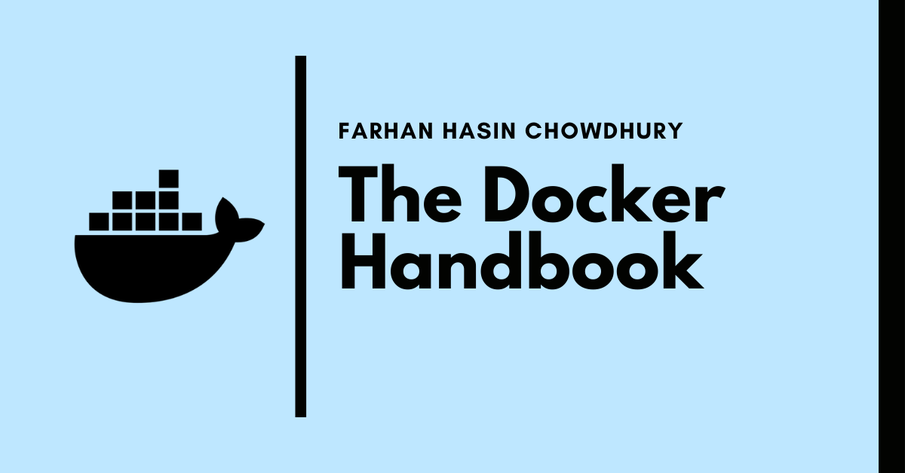

# The Docker Handbook

The concept of containerization itself is pretty old, but the emergence of the [Docker Engine](https://docs.docker.com/get-started/overview/#docker-engine) in 2013 has made it much easier to containerize your applications.

According to the [Stack Overflow Developer Survey - 2020](https://insights.stackoverflow.com/survey/2020#overview), [Docker](https://docker.com/) is the [\#1 most wanted platform](https://insights.stackoverflow.com/survey/2020#technology-most-loved-dreaded-and-wanted-platforms-wanted5), [\#2 most loved platform](https://insights.stackoverflow.com/survey/2020#technology-most-loved-dreaded-and-wanted-platforms-loved5), and also the [\#3 most popular platform](https://insights.stackoverflow.com/survey/2020#technology-platforms).

As in-demand as it may be, getting started can seem a bit intimidating at first. So in this article, we'll be learning everything from basic to intermediate level of containerization. After going through the entire article, you should be able to:

* Containerize \(almost\) any application
* Upload custom Docker Images to online registries
* Work with multiple containers using Docker Compose

## Prerequisites

* Familiarity with the Linux Terminal
* Familiarity with JavaScript \(some later projects use JavaScript\)

## Project Code

Code for the example projects can be found in the following repository:

[https://github.com/fhsinchy/docker-handbook-projects/](https://github.com/fhsinchy/docker-handbook-projects/)

You can find the complete code in the [completed](https://github.com/fhsinchy/docker-handbook-projects/tree/completed) branch.

## Contributions

This article is completely open-source and quality contributions are more than welcomed. You can find the full content in the following repository:

[https://github.com/fhsinchy/the-docker-handbook](https://github.com/fhsinchy/the-docker-handbook)

I usually do my changes and updates on the GitHub version of the article first and then publish them on freeCodeCamp. You can find the always updated and often incomplete version of the article in the following link:

[https://docker-handbook.farhan.dev/](https://docker-handbook.farhan.dev/)

If you're looking for the complete and stable version of the article then freeCodeCamp will be the best place to go:

[https://www.freecodecamp.org/news/the-docker-handbook/](https://www.freecodecamp.org/news/the-docker-handbook/)

Which ever version of the article you end up reading though, don't forget to let me know your opinion. Constructive criticism is always welcomed.

## Awesome Contributors

I am listing the names of the amazing people who have contributed to this small project in alphabetical order.

* [Andrea Trogolo](https://github.com/ATrogolo) - fixed several grammatical mistakes and inconsistencies in code examples.
* [Arsen Melikyan](https://github.com/bugron) - fixed typos and inconsistencies in multiple images and sections.
* [David A. Carley](https://github.com/dacarley) - fixed spelling mistakes in some of the `svg` files.
* [Emilano Vazquez](https://github.com/gamba47) - fixed inconsistencies in code explanations.
* [Steven Cook](https://github.com/Dez-BlueRose) - fixed mistakes and added new sub-sections with better explanations for some of the topics.

Thanks a lot to all of you, I appreciate the effort you guys have put in improving this project. Hoping to collaborate in the future also.

