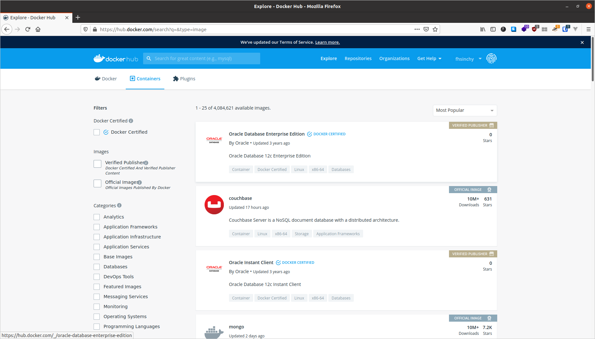

# Hello World in Docker

Now that you have Docker up and running on your machine, it's time for you to run your first container. Open up the terminal and run the following command:

```text
docker run hello-world

# Unable to find image 'hello-world:latest' locally
# latest: Pulling from library/hello-world
# 0e03bdcc26d7: Pull complete 
# Digest: sha256:4cf9c47f86df71d48364001ede3a4fcd85ae80ce02ebad74156906caff5378bc
# Status: Downloaded newer image for hello-world:latest
# 
# Hello from Docker!
# This message shows that your installation appears to be working correctly.
# 
# To generate this message, Docker took the following steps:
#  1. The Docker client contacted the Docker daemon.
#  2. The Docker daemon pulled the "hello-world" image from the Docker Hub.
#     (amd64)
#  3. The Docker daemon created a new container from that image which runs the
#     executable that produces the output you are currently reading.
#  4. The Docker daemon streamed that output to the Docker client, which sent it
#     to your terminal.
#
# To try something more ambitious, you can run an Ubuntu container with:
#  $ docker run -it ubuntu bash
# 
# Share images, automate workflows, and more with a free Docker ID:
#  https://hub.docker.com/
#
# For more examples and ideas, visit:
#  https://docs.docker.com/get-started/

```

The [hello-world](https://hub.docker.com/_/hello-world) image is an example of minimal containerization with Docker. It has a single program compiled from a [hello.c](https://github.com/docker-library/hello-world/blob/master/hello.c) file responsible for printing out the message you're seeing on your terminal.

Now in your terminal, you can use the `docker ps -a` command to have a look at all the containers that are currently running or have run in the past:

```text
docker ps -a

# CONTAINER ID        IMAGE               COMMAND             CREATED             STATUS                     PORTS               NAMES
# 128ec8ceab71        hello-world         "/hello"            14 seconds ago      Exited (0) 13 seconds ago                      exciting_chebyshev
```

In the output, a container named `exciting_chebyshev` was run with the container id of `128ec8ceab71` using the `hello-world` image and has `Exited (0) 13 seconds ago` where the `(0)` exit code means no error was produced during the runtime of the container.

Now in order to understand what just happened behind the scenes, you'll have to get familiar with the Docker Architecture and three very fundamental concepts of containerization in general, which are as follows:

* [Container](hello-world-in-docker.md#container)
* [Image](hello-world-in-docker.md#image)
* [Registry](hello-world-in-docker.md#registry)

I've listed the three concepts in alphabetical order and will begin my explanations with the first one on the list.

## Container

In the world of containerization, there can not be anything more fundamental than the concept of a container. 

The official Docker [resources](https://www.docker.com/resources/what-container) site says, "A container is an abstraction at the application layer that packages code and dependencies together. Instead of virtualizing the entire physical machine, containers virtualize the host operating system only."

You may consider containers as the next generation of virtual machines. Just like virtual machines, containers are completely isolated environments from the host system as well as each other. They are also a lot lighter than the traditional virtual machine hence a large number of containers can be run simultaneously without affecting the performance of the host system.

Containers and virtual machines are actually different ways of virtualizing your physical hardware. The main difference between these two is the method of virtualization.

Virtual machines are usually created and managed by a program known as a hypervisor i.e. [Oracle VM VirtualBox](https://www.virtualbox.org/), [VMware Workstation](https://www.vmware.com/), [KVM](https://www.linux-kvm.org/), [Microsoft Hyper-V ](https://docs.microsoft.com/en-us/virtualization/hyper-v-on-windows/about/)etc. This hypervisor program usually sits between the host operating system and the virtual machines to act as a medium of communication.


Each virtual machine comes with it's own guest operating system which is just as heavy as the host operating system. Application running inside a virtual machine communicates with the guest operating system, which talks to the hypervisor, which then in turn talks to the host operating system to allocate necessary resources from the physical infrastructure to the running application. 

As you can see, there is a long chain of communication between applications running inside virtual machines and the physical infrastructure. The application running inside the virtual machine may take only a small amount of resources but the guest operating system adds a noticeable overhead.

Unlike a virtual machine, a container does the job of virtualization in a smarter way. Instead of having a complete guest operating system inside a container, it just utilizes the host operating system via the container runtime while maintaining isolation just like a traditional virtual machine.


The container runtime i.e. Docker sits between the containers and the host operating system ****instead of a hypervisor. The containers then communicate with the container runtime which then communicates with the host operating system to get necessary resources from the physical infrastructure. As a result of eliminating the entire guest operating system layer, containers are much lighter and less resource hogging than traditional virtual machines.

As a demonstration of the point, look at the following code block:

```text
uname -a
# Linux alpha-centauri 5.8.0-22-generic #23-Ubuntu SMP Fri Oct 9 00:34:40 UTC 2020 x86_64 x86_64 x86_64 GNU/Linux

docker run alpine uname -a
# Linux f08dbbe9199b 5.8.0-22-generic #23-Ubuntu SMP Fri Oct 9 00:34:40 UTC 2020 x86_64 Linux
```

In the code block above, I have executed the `uname -a` command on my host operating system to print out the kernel details. Then on the next line I've executed the same command inside a container running [Alpine Linux](https://alpinelinux.org/). As can be seen in the output, the container is indeed using the kernel from my host operating system. This goes to prove the point that containers virtualize the host operating system instead of having an operating system of their own.

If you're on a Windows machine, you'll find out that all the containers uses the WSL2 kernel. It happens because WSL2 acts as the back-end for Docker on Windows. On macOS the default back-end is a VM running on [HyperKit](https://github.com/moby/hyperkit) hypervisor.

## Image

Images are multi-layered self-contained files that act as the template for creating containers. They are like a frozen, read-only copy of a container. Images can be exchanged through registries. 

In the past, different container engines had different image formats but later on [Open Container Initiative \(OCI\)](https://opencontainers.org/) defined a standard specification for container images which is complied by the major containerization engines out there. This means that an image built with Docker can be used with another runtime like Podman without any additional hassle.

Containers are just images in running state. When you obtain an image from the internet and run a container using that, you essentially create another temporary writable layer on top of the previous read-only ones. This concept will become a lot more clearer in upcoming chapters but for now, just keep in mind that images are multi-layered read-only files carrying your application in a desired state inside them.

## Registry

You've already learned about two very important pieces of the puzzle, _Container_ and _Image_. The final piece is _Registry_. An image registry is a centralized place where you can upload your images and can also download images created by others. [Docker Hub](https://hub.docker.com/) is the default public registry for Docker. Another very popular image registry is [Quay](https://quay.io/) by Red Hat. Throughout this article I'll be using Docker Hub as my registry of choice.



You can share any number of public images on Docker Hub for free. People around the world will be able to download them and use them freely. Images that I've uploaded are available on my profile \([fhsinchy](https://hub.docker.com/u/fhsinchy)\) page.


Apart from Docker Hub or Quay, you can also create your own image registry for hosting private images. There is also a local registry that runs within your computer that caches images pulled from remote registries.

## Docker Architecture

Now that you've become familiar with most of the fundamental concepts regarding containerization and Docker, it's time for you to understand how Docker as a software has been designed.

The engine consists of three major components:

1. **Docker Daemon:** The daemon \(`dockerd`\) is a process that keeps running in the background and waits for commands from the client. The daemon is capable of managing various Docker objects.
2. **Docker Client:** The client  \(`docker`\) is a command-line interface program mostly responsible for transporting commands issued by users.
3. **REST API:** The REST API acts as a bridge between the daemon and the client. Any command issued using the client passes through the API to finally reach the daemon.

According to the official [docs](https://docs.docker.com/get-started/overview/#docker-architecture), "Docker uses a client-server architecture. The Docker _client_ talks to the Docker _daemon_, which does the heavy lifting of building, running, and distributing your Docker containers".

You as user will usually execute commands using the client component. The client then use the REST API to reach out to the long running daemon and get your work done.

## The Full Picture

Okay, enough talking. Now it's time for you to understand how all these pieces of puzzle you just learned about works in harmony. Before I dive into the explanation of what really happened when you ran `docker run hello-world` command, let me show you a little diagram I've made:


This image is a slightly modified version of the one found in the official [docs](https://docs.docker.com/engine/images/architecture.svg). The series of events that occurred when you executed the command can be listed as follows:

1. You execute `docker run hello-world` command where `hello-world` is the name of an image.
2. Docker client reaches out to the daemon, tells it to get the `hello-world` image and run a container from that.
3. Docker daemon looks for the image within your local repository and realizes that it's not there, hence the `Unable to find image 'hello-world:latest' locally` line gets printed on your terminal.
4. The daemon then reaches out to the default public registry which is Docker Hub and pulls in the latest copy of the `hello-world` image, indicated by the `latest: Pulling from library/hello-world` line in your terminal.
5. Docker daemon then creates a new container from the freshly pulled image.
6. Finally Docker daemon runs the container created using the `hello-world` image outputting the wall of text on your terminal.

It's the default behavior of Docker daemon to look for images in the hub, that are not present locally. But once an image has been fetched, it'll stay in the local cache. So if you execute the command again, you won't see the following lines in the output:

```text
Unable to find image 'hello-world:latest' locally
latest: Pulling from library/hello-world
0e03bdcc26d7: Pull complete
Digest: sha256:d58e752213a51785838f9eed2b7a498ffa1cb3aa7f946dda11af39286c3db9a9
Status: Downloaded newer image for hello-world:latest
```

If there is a newer version of the image available on the public registry, the daemon will fetch the image again. That `:latest` is a tag. Images usually have meaningful tags to indicate versions or builds. You'll learn about this in greater detail later on.

