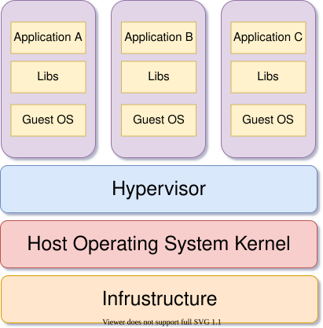
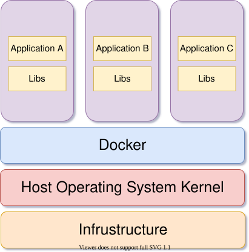
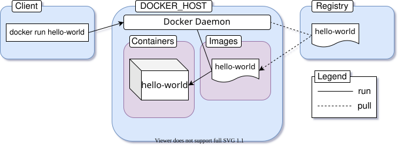

# Running Your First Containers

Now that you have Docker up and running on your machine, it's time for you to run your first container. Open up the terminal and run the following command:

```text
docker run hello-world

# Unable to find image 'hello-world:latest' locally
# latest: Pulling from library/hello-world
# e6590344b1a5: Pull complete
# Digest: sha256:c41088499908a59aae30a85972fecd147e1a1e8df6e2b3f1e55884ba69e3b0f0
# Status: Downloaded newer image for hello-world:latest
#
# Hello from Docker!
# This message shows that your installation appears to be working correctly.
#
# To generate this message, Docker took the following steps:
#  1. The Docker client contacted the Docker daemon.
#  2. The Docker daemon pulled the "hello-world" image from the Docker Hub.
#     (amd64)
#  3. The Docker daemon created a new container from that image which runs the
#     executable that produces the output you are currently reading.
#  4. The Docker daemon streamed that output to the Docker client, which sent it
#     to your terminal.
#
# To try something more ambitious, you can run an Ubuntu container with:
#  $ docker run -it ubuntu bash
#
# Share images, automate workflows, and more with a free Docker ID:
#  https://hub.docker.com/
#
# For more examples and ideas, visit:
#  https://docs.docker.com/get-started/
```

The [hello-world](https://hub.docker.com/_/hello-world) image is an example of minimal containerization with Docker. It has a single program compiled from a [hello.c](https://github.com/docker-library/hello-world/blob/master/hello.c) file responsible for printing out the message you're seeing on your terminal.

Now in your terminal, you can use the `docker ps -a` command to have a look at all the containers that are currently running or have run in the past:

```text
docker ps -a

# CONTAINER ID   IMAGE         COMMAND    CREATED          STATUS                      PORTS   NAMES
# 128ec8ceab71   hello-world   "/hello"   14 seconds ago   Exited (0) 13 seconds ago           exciting_chebyshev
```

In the output, a container named `exciting_chebyshev` was run with the container id of `128ec8ceab71` using the `hello-world` image and has `Exited (0) 13 seconds ago` where the `(0)` exit code means no error was produced during the runtime of the container.

Now in order to understand what just happened behind the scenes, you'll have to get familiar with the Docker Architecture and three very fundamental concepts of containerization in general, which are as follows:

* [Container](#container)
* [Image](#image)
* [Registry](#registry)

I've listed the three concepts in alphabetical order and will begin my explanations with the first one on the list.

## Container

In the world of containerization, there can not be anything more fundamental than the concept of a container.

The official Docker [resources](https://www.docker.com/resources/what-container) site says, "A container is an abstraction at the application layer that packages code and dependencies together. Instead of virtualizing the entire physical machine, containers virtualize the host operating system only."

You may consider containers as the next generation of virtual machines. Just like virtual machines, containers are completely isolated environments from the host system as well as each other. They are also a lot lighter than the traditional virtual machine, hence a large number of containers can be run simultaneously without affecting the performance of the host system.

Containers and virtual machines are actually different ways of virtualizing your physical hardware. The main difference between these two is the method of virtualization.

Virtual machines are usually created and managed by a program known as a hypervisor i.e. [Oracle VM VirtualBox](https://www.virtualbox.org/), [VMware Workstation](https://www.vmware.com/), [KVM](https://www.linux-kvm.org/), [Microsoft Hyper-V](https://docs.microsoft.com/en-us/virtualization/hyper-v-on-windows/about/), etc. This hypervisor program usually sits between the host operating system and the virtual machines to act as a medium of communication.



Each virtual machine comes with its own guest operating system which is just as heavy as the host operating system. Applications running inside a virtual machine communicate with the guest operating system, which talks to the hypervisor, which then in turn talks to the host operating system to allocate necessary resources from the physical infrastructure to the running application.

As you can see, there is a long chain of communication between applications running inside virtual machines and the physical infrastructure. The application running inside the virtual machine may take only a small amount of resources but the guest operating system adds a noticeable overhead.

Unlike a virtual machine, a container does the job of virtualization in a smarter way. Instead of having a complete guest operating system inside a container, it just utilizes the host operating system via the container runtime while maintaining isolation just like a traditional virtual machine.



The container runtime i.e. Docker sits between the containers and the host operating system instead of a hypervisor. The containers then communicate with the container runtime which then communicates with the host operating system to get necessary resources from the physical infrastructure. As a result of eliminating the entire guest operating system layer, containers are much lighter and less resource-hogging than traditional virtual machines.

As a demonstration of the point, look at the following code block:

```text
uname -a
# Linux alpha-centauri 5.8.0-22-generic #23-Ubuntu SMP Fri Oct 9 00:34:40 UTC 2020 x86_64 x86_64 x86_64 GNU/Linux

docker run alpine uname -a
# Linux f08dbbe9199b 5.8.0-22-generic #23-Ubuntu SMP Fri Oct 9 00:34:40 UTC 2020 x86_64 Linux
```

In the code block above, I have executed the `uname -a` command on my host operating system to print out the kernel details. Then on the next line I've executed the same command inside a container running [Alpine Linux](https://alpinelinux.org/). As can be seen in the output, the container is indeed using the kernel from my host operating system. This goes to prove the point that containers virtualize the host operating system instead of having an operating system of their own.

If you're on a Windows machine, you'll find out that all the containers uses the WSL2 kernel. It happens because WSL2 acts as the back-end for Docker on Windows. On macOS the default back-end is a lightweight virtual machine managed by Docker Desktop.

## Image

Images are multi-layered self-contained files that act as the template for creating containers. They are like a frozen, read-only copy of a container. Images can be exchanged through registries.

In the past, different container engines had different image formats but later on [Open Container Initiative \(OCI\)](https://opencontainers.org/) defined a standard specification for container images which is complied by the major containerization engines out there. This means that an image built with Docker can be used with another runtime like Podman without any additional hassle.

Containers are just images in running state. When you obtain an image from the internet and run a container using that, you essentially create another temporary writable layer on top of the previous read-only ones. This concept will become a lot clearer in upcoming chapters but for now, just keep in mind that images are multi-layered read-only files carrying your application in a desired state inside them.

## Registry

You've already learned about two very important pieces of the puzzle, _Container_ and _Image_. The final piece is _Registry_. An image registry is a centralized place where you can upload your images and can also download images created by others. [Docker Hub](https://hub.docker.com/) is the default public registry for Docker. Another very popular image registry is [Quay](https://quay.io/) by Red Hat. Throughout this book I'll be using Docker Hub as my registry of choice.

You can share any number of public images on Docker Hub for free. People around the world will be able to download them and use them freely. Images that I've uploaded are available on my profile \([fhsinchy](https://hub.docker.com/u/fhsinchy)\) page.

Apart from Docker Hub or Quay, you can also create your own image registry for hosting private images. There is also a local registry that runs within your computer that caches images pulled from remote registries.

## Docker Architecture

Now that you've become familiar with most of the fundamental concepts regarding containerization and Docker, it's time for you to understand how Docker as a software has been designed.

The engine consists of three major components:

1. **Docker Daemon:** The daemon \(`dockerd`\) is a process that keeps running in the background and waits for commands from the client. The daemon is capable of managing various Docker objects.
2. **Docker Client:** The client  \(`docker`\) is a command-line interface program mostly responsible for transporting commands issued by users.
3. **REST API:** The REST API acts as a bridge between the daemon and the client. Any command issued using the client passes through the API to finally reach the daemon.

According to the official [docs](https://docs.docker.com/get-started/overview/#docker-architecture), "Docker uses a client-server architecture. The Docker _client_ talks to the Docker _daemon_, which does the heavy lifting of building, running, and distributing your Docker containers".

You as user will usually execute commands using the client component. The client then use the REST API to reach out to the long running daemon and get your work done.

## The Full Picture

Okay, enough talking. Now it's time for you to understand how all these pieces of puzzle you just learned about works in harmony. Before I dive into the explanation of what really happened when you ran the command `docker run hello-world`, let me show you a little diagram I've made:



This image is a slightly modified version of the one found in the official [docs](https://docs.docker.com/engine/images/architecture.svg). The series of events that occurred when you executed the command can be listed as follows:

1. You execute the command `docker run hello-world` where `hello-world` is the name of an image.
2. Docker client reaches out to the daemon, tells it to get the `hello-world` image and run a container from that.
3. Docker daemon looks for the image within your local repository and realizes that it's not there, hence the `Unable to find image 'hello-world:latest' locally` line gets printed on your terminal.
4. The daemon then reaches out to the default public registry which is Docker Hub and pulls in the latest copy of the `hello-world` image, indicated by the `latest: Pulling from library/hello-world` line in your terminal.
5. Docker daemon then creates a new container from the freshly pulled image.
6. Finally, Docker daemon runs the container created using the `hello-world` image outputting the wall of text on your terminal.

It's the default behavior of Docker daemon to look for images in the hub, that are not present locally. But once an image has been fetched, it'll stay in the local cache. So if you execute the command again, you won't see the following lines in the output:

```text
Unable to find image 'hello-world:latest' locally
latest: Pulling from library/hello-world
e6590344b1a5: Pull complete
Digest: sha256:c41088499908a59aae30a85972fecd147e1a1e8df6e2b3f1e55884ba69e3b0f0
Status: Downloaded newer image for hello-world:latest
```

If there is a newer version of the image available on the public registry, the daemon will fetch the image again. That `:latest` is a tag. Images usually have meaningful tags to indicate versions or builds. You'll learn about this in greater detail later on.

## Running a Real Application

The `hello-world` image is great for verifying your setup, but it exits immediately. Let's run something more useful. The `fhsinchy/hello-dock` image contains a simple web application that runs on port 80 inside the container.

Although this is a perfectly valid command, there is a better way of dispatching commands to the `docker` daemon. Prior to version `1.13`, Docker had only the previously mentioned command syntax. Later on, the command-line was [restructured](https://www.docker.com/blog/whats-new-in-docker-1-13/) to have the following syntax:

```text
docker <object-type> <command> <options>
```

In this syntax:

* `object-type` indicates the type of Docker object you'll be manipulating. This can be a `container`, `image`, `network` or `volume` object.
* `command` indicates the task to be carried out by the daemon i.e. `run` command.
* `options` can be any valid parameter that can override the default behavior of the command i.e. the `--publish` option for port mapping.

Now, following this syntax, the `run` command can be written as follows:

```text
docker container run <image name>
```

Throughout the rest of this book, I'll be using this newer, more explicit syntax. Now to run a container using the `fhsinchy/hello-dock` image, execute the following command:

```text
docker container run --publish 8080:80 fhsinchy/hello-dock

# /docker-entrypoint.sh: /docker-entrypoint.d/ is not empty, will attempt to perform configuration
# /docker-entrypoint.sh: Looking for shell scripts in /docker-entrypoint.d/
# /docker-entrypoint.sh: Launching /docker-entrypoint.d/10-listen-on-ipv6-by-default.sh
# 10-listen-on-ipv6-by-default.sh: Getting the checksum of /etc/nginx/conf.d/default.conf
# 10-listen-on-ipv6-by-default.sh: Enabled listen on IPv6 in /etc/nginx/conf.d/default.conf
# /docker-entrypoint.sh: Launching /docker-entrypoint.d/20-envsubst-on-templates.sh
# /docker-entrypoint.sh: Configuration complete; ready for start up
```

## Publishing Ports

Containers are isolated environments. Your host system doesn't know anything about what's going on inside a container. Hence, applications running inside a container remains inaccessible from the outside.

To allow access from outside of a container, you must publish the appropriate port inside the container to a port on your local network. The generic syntax for the `--publish` or `-p` option is as follows:

```text
--publish <host port>:<container port>
```

When you wrote `--publish 8080:80` in the previous sub-section, it meant any request sent to port 8080 of your host system will be forwarded to port 80 inside the container.

Now to access the application on your browser, visit `http://127.0.0.1:8080` address.

The container can be stopped by simply hitting `ctrl + c` key combination while the terminal window is in focus or closing off the terminal window completely.

## Detached Mode

Another very popular option of the `run` command is the `--detach` or `-d` option. In the example above, in order for the container to keep running, you had to keep the terminal window open. Closing the terminal window also stopped the running container.

This is because by default containers run in the foreground and attach themselves to the terminal like any other normal program invoked from the terminal. In order to override this behavior and keep a container running in background, you can include the `--detach` option to the `run` command as follows:

```text
docker container run --detach --publish 8080:80 fhsinchy/hello-dock

# 9f21cb77705810797c4b847dbd330d9c732ffddba14fb435470567a7a3f46cdc
```

Unlike the previous example, you won't get a wall of text thrown at you this time. Instead what you'll get is the ID of the newly created container.

The order of the options you provide doesn't really matter. If you put the `--publish` option before the `--detach` option, it'll work just the same. One thing that you have to keep in mind in case of the `run` command is that the image name must come last. If you put anything after the image name then that'll be passed as an argument to the container entry-point and may result in unexpected situations.

## Listing Containers

The `container ls` command can be used to list out containers that are currently running. To do so execute following command:

```text
docker container ls

# CONTAINER ID   IMAGE                 COMMAND                  CREATED          STATUS          PORTS                  NAMES
# 9f21cb777058   fhsinchy/hello-dock   "/docker-entrypoint.…"   5 seconds ago    Up 5 seconds    0.0.0.0:8080->80/tcp   gifted_sammet
```

As you can see in the output, a container named `gifted_sammet` is running. It was created `5 seconds ago` and the status is `Up 5 seconds,` which indicates that the container is running fine since it's creation.

The `CONTAINER ID` is `9f21cb777058` which is the first 12 characters of the full container ID. The full container ID is the 64 character long string that was printed as the output of the `docker container run` command in the previous sub-section.

Listed under the `PORTS` column, port 8080 from your local network is pointing towards port 80 inside the container. The name `gifted_sammet` is generated by Docker and can be something completely different on your computer.

The `container ls` command only lists the containers that are currently running on your system. In order to list out the containers that has run in the past you can use the `--all` or `-a` option.

```text
docker container ls --all

# CONTAINER ID   IMAGE                 COMMAND                  CREATED          STATUS                      PORTS                  NAMES
# 9f21cb777058   fhsinchy/hello-dock   "/docker-entrypoint.…"   2 minutes ago    Up 2 minutes                0.0.0.0:8080->80/tcp   gifted_sammet
# 6cf52771dde1   fhsinchy/hello-dock   "/docker-entrypoint.…"   3 minutes ago    Exited (0) 3 minutes ago                           reverent_torvalds
# 128ec8ceab71   hello-world           "/hello"                 4 minutes ago    Exited (0) 4 minutes ago                           exciting_chebyshev
```

As you can see the second container in the list `reverent_torvalds` was created earlier and has exited with the status code 0, which indicates that no error was produced during the runtime of the container.

Now before moving on to the next chapter, stop the running container by executing `docker container stop gifted_sammet` \(replace `gifted_sammet` with whatever name Docker assigned on your system\). You'll learn much more about stopping, removing, and managing containers in the next chapter.

