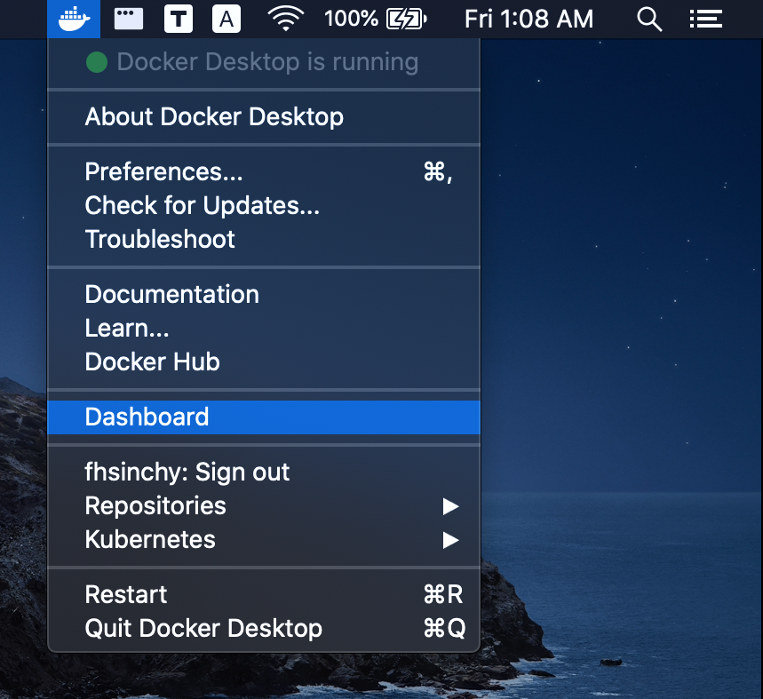
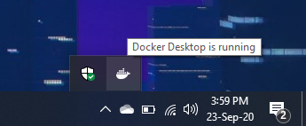
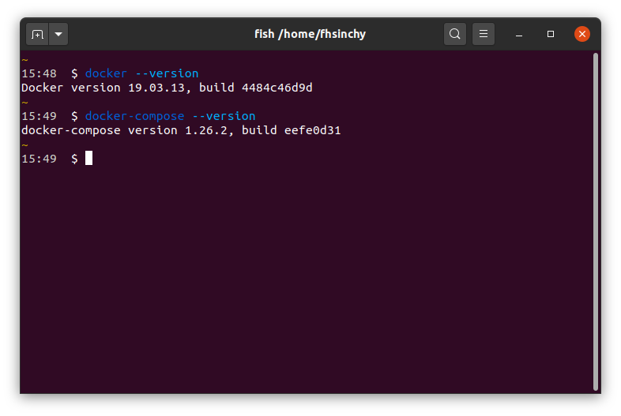

# Installing Docker

Now that you've a solid understanding of what containerization is and the role Docker plays in it, it's time to get Docker installed on your machine. In this chapter, I'll walk you through installing Docker on all three major platforms — Mac, Windows, and Linux — and then we'll verify that everything is working properly by running a quick test.

I'm not going to bore you with step-by-step screenshots of the installation process. The Docker team does a great job maintaining their official documentation, and frankly, installer screenshots age faster than milk left out on a summer day. Instead, I'll point you to the right pages and share what you actually need to know that the docs might not emphasize enough.

## Installing Docker on macOS

If you're on a Mac, you'll be installing **Docker Desktop** which bundles everything you need into a single application. Docker Desktop includes the Docker Engine, the Docker CLI, Docker Compose, and a graphical dashboard.

Head over to the official [Docker Desktop for Mac](https://docs.docker.com/desktop/install/mac-install/) page and download the installer appropriate for your chip \(Intel or Apple Silicon\). Once downloaded, you'll get a regular looking Apple Disk Image file. Open it up, drag Docker into your Applications directory, and launch it.

After Docker Desktop starts up, you'll see the Docker icon appear in your menu bar. That little whale icon means the Docker daemon is running and ready to accept commands.



That's really all there is to it on macOS. I would suggest giving it a minute or two after the first launch, since Docker Desktop needs to set up its Linux virtual machine in the background before it becomes fully operational.

## Installing Docker on Windows

On Windows, the process requires a bit more groundwork but it's still very manageable. Before installing Docker Desktop, you need to have **WSL2** \(Windows Subsystem for Linux 2\) set up on your system. WSL2 provides a real Linux kernel running inside Windows, and Docker Desktop uses it as its backend.

If you haven't set up WSL2 yet, follow the official [WSL installation guide](https://learn.microsoft.com/en-us/windows/wsl/install) from Microsoft. On modern versions of Windows 10 and Windows 11, it's often as simple as running `wsl --install` in an elevated PowerShell window, but the guide covers edge cases and older builds as well.

Once WSL2 is ready, head over to the official [Docker Desktop for Windows](https://docs.docker.com/desktop/install/windows-install/) page and download the installer. Double-click the downloaded file and go through the installation with the defaults. Make sure the option to use WSL2 as the backend is checked during setup.

After installation, start Docker Desktop from the Start menu. The Docker icon should show up in your taskbar.



You can access Docker from your regular Command Prompt or PowerShell, but I prefer using WSL2 over any other command line on Windows. Open up Ubuntu or whatever distribution you've installed from the Microsoft Store, and you'll have full access to the `docker` command from there.

## Installing Docker on Linux

Now here's where things get interesting. On Linux, you have two options. You can either install **Docker Desktop** \(yes, it's available for Linux now\) or you can install the **Docker Engine** directly. In my opinion, if you're on Linux, you probably don't need the Desktop application. The engine and CLI tools are all you really need, and they run natively without any virtual machine overhead.

I prefer Linux for Docker work, and I usually go with just the engine. Docker on Linux runs natively on the host kernel, which means you get the best possible performance without the abstraction layer that Docker Desktop adds on Mac and Windows.

For installing the Docker Engine, the official docs have per-distribution guides:

- [Install Docker Engine on Ubuntu](https://docs.docker.com/engine/install/ubuntu/)
- [Install Docker Engine on Debian](https://docs.docker.com/engine/install/debian/)
- [Install Docker Engine on Fedora](https://docs.docker.com/engine/install/fedora/)
- [Install Docker Engine on CentOS](https://docs.docker.com/engine/install/centos/)

If you're on a distribution not listed above, you can follow the [Install Docker Engine from binaries](https://docs.docker.com/engine/install/binaries/) guide instead.

Regardless of which distribution guide you follow, you'll want to go through the [Post-installation steps for Linux](https://docs.docker.com/engine/install/linux-postinstall/) as well. These steps are important because they let you run Docker commands without `sudo`, which saves you a lot of typing throughout your day.

If you do opt for Docker Desktop on Linux, the installation page is [here](https://docs.docker.com/desktop/install/linux-install/). It supports Ubuntu, Debian, and Fedora officially.

## A Note on Docker Compose

In the older days, Docker Compose was a separate binary called `docker-compose` that you had to install independently. This was especially relevant on Linux where the engine didn't come bundled with Compose.

The good news is that **Compose v2** is now integrated directly into Docker. Instead of the old `docker-compose` command with a hyphen, you now use `docker compose` \(with a space\) as a subcommand of the Docker CLI. If you're installing Docker Desktop on Mac, Windows, or Linux, Compose v2 comes included out of the box. If you're installing just the Docker Engine on Linux, Compose v2 is available as a CLI plugin and most of the official installation guides include it.

Keep in mind that throughout this book, whenever I use Compose, I'll be using the `docker compose` syntax \(with a space\), not the legacy `docker-compose` syntax. If you see older tutorials around the internet using the hyphenated version, just know that the space version is the modern equivalent.

## Verifying Your Installation

Regardless of which platform you're on, the verification process is the same. Open up your terminal and run the following commands:

```text
docker --version

# Docker version 27.5.1, build 9f9e405
```

```text
docker compose version

# Docker Compose version v2.32.4
```

Your version numbers will likely be different from mine, and that's perfectly fine. What matters is that both commands produce output without any errors. If you see something like "command not found," go back and double-check your installation steps.



Now lets run a quick test to make sure Docker can actually pull images and run containers. Execute the following command:

```text
docker run hello-world

# Unable to find image 'hello-world:latest' locally
# latest: Pulling from library/hello-world
# e6590344b1a5: Pull complete
# Digest: sha256:c41088499908a59aae8c1b05a55c4d9e77fc8e27a3c6a3b0d7962e4568e3b38c
# Status: Downloaded newer image for hello-world:latest
#
# Hello from Docker!
# This message shows that your installation appears to be working correctly.
#
# To generate this message, Docker took the following steps:
#  1. The Docker client contacted the Docker daemon.
#  2. The Docker daemon pulled the "hello-world" image from the Docker Hub.
#     (amd64)
#  3. The Docker daemon created a new container from that image which runs the
#     executable that produces the output you are currently reading.
#  4. The Docker daemon streamed that output to the Docker client, which sent it
#     to your terminal.
#
# To try something more ambitious, you can run an Ubuntu container with:
#  $ docker run -it ubuntu bash
#
# Share images, automate workflows, and more with a free Docker ID:
#  https://hub.docker.com/
#
# For more examples and ideas, visit:
#  https://docs.docker.com/get-started/
```

As you can see, Docker pulled the `hello-world` image from Docker Hub, created a container from it, ran the program inside, and printed that message to your terminal. Congratulations! Your Docker installation is working correctly.

## GUI Tools and the CLI

Before we move on, I want to clarify something. Docker Desktop comes with a nice graphical dashboard that lets you manage containers, images, and volumes through a visual interface. There are also third-party GUI tools like [Portainer](https://www.portainer.io/) that provide web-based management interfaces.

I'm aware of these tools and some of them are genuinely useful in certain workflows. However, throughout this entire book, I'll be working exclusively with the command line. Learning the common Docker commands is one of the primary goals of this book, and there is no better way to build that muscle memory than typing the commands yourself.

I would suggest you do the same. Once you've a strong grasp of the CLI, feel free to explore whatever GUI tools catch your eye. But the CLI knowledge will serve you everywhere — on remote servers, in CI/CD pipelines, and in environments where a graphical interface simply isn't available.

## Cleaning Up Before Moving On

That `hello-world` container we just ran is still sitting around on your system in a stopped state. Since we're going to be working with containers properly in the upcoming chapters, lets clean things up so we start fresh.

First, lets see what containers are lingering around:

```text
docker ps -a

# CONTAINER ID   IMAGE         COMMAND    CREATED          STATUS                      PORTS   NAMES
# 4c01db0b339c   hello-world   "/hello"   2 minutes ago    Exited (0) 2 minutes ago            pensive_darwin
```

The `docker ps -a` command lists all containers, including stopped ones. You can see our `hello-world` container sitting there with a status of `Exited (0)`. To remove it, use the `docker rm` command followed by the container identifier:

```text
docker rm 4c01db0b339c

# 4c01db0b339c
```

You can also remove the `hello-world` image if you like, since we won't be needing it again:

```text
docker image rm hello-world

# Untagged: hello-world:latest
# Untagged: hello-world@sha256:c41088499908a59aae8c1b05a55c4d9e77fc8e27a3c6a3b0d7962e4568e3b38c
# Deleted: sha256:74cc54e27dc41bb10dc4b2226072d469509f2f22f1a3ce74f4a59c7a3e01b1a0
# Deleted: sha256:63a41611c4d3e2e0b4dbb63a4e833e29e9493ea4ad58761e19b3a2c73b9c3ec5
```

Keep in mind that your container ID, container name, and image digests will be different from mine. Use whatever values show up in your own terminal output.

With a clean slate, you're ready for the next chapter where we'll start running containers for real.
